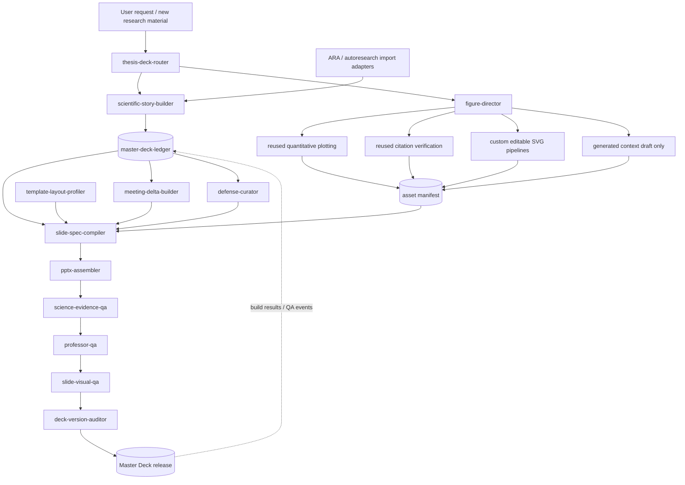

# IMPLEMENTATION REPORT

## 1. Repository audit

### Objective and scope

Phase 0 audited the repository and defines an implementation architecture for a cumulative thesis presentation system. No production system, custom skill, schema, fixture, presentation, or generated asset was implemented. This report is the only Phase 0 artifact and the work must remain at `awaiting_review` until the reviewer returns `APPROVE`, `REVISE`, or `REJECT`.

### Current relevant directory structure

The branch contains 98 `SKILL.md` files across 23 numbered categories. The relevant subset is:

```text
AI-Research-SKILLs/
├── 0-autoresearch-skill/
│   ├── SKILL.md
│   ├── references/
│   │   ├── agent-continuity.md
│   │   ├── progress-reporting.md
│   │   └── skill-routing.md
│   └── templates/
│       ├── findings.md
│       ├── progress-presentation.html
│       ├── research-log.md
│       └── research-state.yaml
├── 20-ml-paper-writing/
│   ├── academic-plotting/
│   │   ├── SKILL.md
│   │   └── references/
│   │       ├── data-visualization.md
│   │       ├── diagram-generation.md
│   │       └── style-guide.md
│   ├── ml-paper-writing/
│   │   └── references/citation-workflow.md
│   └── presenting-conference-talks/
│       ├── SKILL.md
│       └── references/slide-templates.md
├── 22-agent-native-research-artifact/
│   ├── compiler/
│   │   ├── SKILL.md
│   │   └── references/
│   │       ├── ara-schema.md
│   │       ├── exploration-tree-spec.md
│   │       └── validation-checklist.md
│   ├── research-manager/
│   │   ├── SKILL.md
│   │   └── references/
│   │       ├── event-taxonomy.md
│   │       ├── provenance-tags.md
│   │       └── session-protocol.md
│   └── rigor-reviewer/
│       ├── SKILL.md
│       └── references/review-dimensions.md
├── .claude-plugin/marketplace.json
├── .github/workflows/
│   ├── check-inventory.yml
│   ├── publish-npm.yml
│   └── sync-skills.yml
├── docs/
│   ├── SKILL_CREATION_GUIDE.md
│   └── SKILL_TEMPLATE.md
├── packages/ai-research-skills/
│   └── src/
│       ├── agents.js
│       ├── installer.js
│       └── prompts.js
├── scripts/check-inventory.sh
└── thesis-deck-system/
    ├── REVIEW_PROTOCOL.md
    ├── TASK_PHASE_0.md
    └── reports/
        └── PHASE_0_IMPLEMENTATION_REPORT.md
```

No `.pptx`, `.pptm`, `.potx`, `.potm`, legacy `.ppt`, or `.odp` file is present. There is no NCKU/AMPL template, laboratory deck, slide render fixture, OpenXML profiler, PptxGenJS implementation, Draw.io asset, or PowerPoint engineering test. The root `package.json` has only a deliberately failing placeholder `test` script; current CI validates inventory and publishing/synchronization behavior, not presentation output.

### Existing skill conventions

Repository conventions that the new category should follow:

- A discoverable skill is a directory containing `SKILL.md` with YAML frontmatter: kebab-case `name`, third-person trigger-oriented `description`, semantic `version`, `author`, `license`, tags, and direct dependencies.
- `SKILL.md` is the concise routing/workflow layer. Detailed material belongs one level down in `references/`; deterministic work belongs in `scripts/`; reusable examples or templates belong in `assets/` or `templates/`.
- Workflows use explicit checklists and validate-fix-repeat feedback loops. Critical actions should be executed by scripts rather than left to unconstrained prose.
- Paths inside skills use `/`, references remain one level deep, and outputs have concrete input/output examples.
- Numbered top-level categories are wired into several registries: `.claude-plugin/marketplace.json`, `packages/ai-research-skills/src/prompts.js`, installer category lists, README/WELCOME inventory text, and inventory CI. Adding skills without updating all relevant registries creates installation and count drift.
- `.github/workflows/sync-skills.yml` currently recognizes numbered two-digit category paths. A new `23-thesis-deck-system/` category fits that convention; placing installable skills only under the unnumbered task directory would bypass automatic skill synchronization.

### Existing reusable components

| Existing component | Reuse decision | Reusable behavior | Required adaptation |
|---|---|---|---|
| `0-autoresearch-skill` | Reuse concepts, not its workspace schema verbatim | Two-loop research operation, hypothesis/experiment tracking, negative-result discipline, Git milestone protocol, progress reporting | The thesis system needs stable research-block IDs, scientific-method stages, deck projections, and an append-only event cursor rather than one mutable `research-state.yaml` |
| ARA `research-manager` | Reuse provenance vocabulary and append discipline | `user`, `ai-suggested`, `ai-executed`, `user-revised`; session/event extraction; append rather than overwrite; decisions, experiments, dead ends, pivots | Presentation state must be recorded during explicit ledger operations, not only as a post-task epilogue; provenance must extend to claims, assets, slide assertions, and curation decisions |
| ARA `compiler` | Reuse evidence fidelity and claim/proof linkage | Raw vs derived evidence distinction, exact-source identifiers, claims bounded by evidence, progressive disclosure, evidence index | Replace paper-centric ARA files with project research blocks and typed evidence cards; keep source checksum, locator, extraction method, and transformation chain |
| ARA `rigor-reviewer` | Reuse epistemic dimensions | Evidence relevance, falsifiability, scope calibration, argument coherence, exploration integrity, methodological rigor | Add the mandated Scientific Method sequence, explicit discussion questions, slide-level claim coverage, professor-style decision gates, and presentation-specific severities |
| `academic-plotting` quantitative workflow | Reuse and harden | Matplotlib/seaborn chart selection, script retention, vector export, PNG preview, accessibility considerations | Remove the assumption that “boxes and arrows” should directly become a Gemini raster. Require editable SVG for mechanisms/setups and carry dataset hash, units, uncertainty, and plotting script in the asset manifest |
| `ml-paper-writing` citation workflow | Reuse | Search, existence verification, BibTeX retrieval, claim validation, consistent citation keys | Add figure-level provenance: source page/figure, license/usage notes, crop bounds, extraction checksum, and a prohibition on generated substitutes for literature evidence |
| `presenting-conference-talks` | Reuse narrative heuristics only | Takeaway-first titles, figure-led slides, speaker notes, timing, editable PPTX intent | It produces generic paper talks, has no cumulative ledger, no meeting/defense view model, no native master profiler, and no render/repair loop |
| `demos/scientific-plotting-demo` | Reuse as style/test inspiration | Reproducible plot scripts with PDF/PNG outputs | It is not schema-driven and has no provenance contract or deck integration |
| Inventory/sync CI | Extend later | Detects skill inventory drift and packages skill folders | Phase 1 should not update public installation metadata until the architecture slice passes local fixtures; later phases must update every registry atomically |

### Conflicts and duplication risks

1. **Two competing research sources of truth.** Autoresearch state, ARA files, and a new deck ledger could diverge. The proposed system therefore defines one presentation-facing canonical ledger and imports/references ARA/autoresearch entities rather than copying their truth into parallel free-form records.
2. **Dead-end semantics.** ARA treats a `dead_end` as a leaf. Thesis work often learns from a failure and continues. The proposed model keeps a failed experiment immutable, then links a new decision or block with `derived_from`/`triggered_by`; it does not mutate the failure into a successful branch.
3. **Image-generation policy conflict.** The existing academic plotting skill routes architecture diagrams to generated raster images. That conflicts with the required editable-vector policy. Only its quantitative plotting workflow is directly reusable; generated mechanism art may be a labeled draft and must be redrawn before scientific use.
4. **Generic PPTX generation vs native templates.** Existing `python-pptx` examples start from a blank presentation and do not prove master/layout preservation. The assembler must start from a profiled template package and test relationships, placeholders, theme, notes, and round-trip behavior.
5. **Schema duplication across skills.** Contract definitions must live in one versioned schema package. Skills may explain contracts but must not maintain private variants.
6. **Registry drift.** The marketplace, npm prompts, installer category lists, README counts, and sync workflow are partly hard-coded. Production skill registration must be a single reviewed change after the new category is stable.
7. **Mutable binary noise.** Committing every regenerated PPTX can make review opaque. Canonical text contracts, event logs, source assets, and checksums should drive reproducible binaries; binary outputs are release artifacts with manifest bindings, not the only history.

## 2. Proposed architecture

### Evaluated approaches

| Approach | Strength | Failure mode | Decision |
|---|---|---|---|
| One monolithic thesis-to-PPT skill | Simple discovery and invocation | Mixes research truth, graphics, layout, assembly, and QA; hard to test; encourages one-shot regeneration | Reject |
| Independent skills sharing loose Markdown | Matches repository style and is easy to add incrementally | Contract drift and ambiguous ownership; meeting/defense views can silently rewrite history | Reject |
| Contract-first multi-skill system over a canonical event ledger | Clear boundaries, deterministic projections, independent QA, reversible curation, reusable tooling | More initial schema and fixture work; requires disciplined migrations | **Recommend** |

### Module/skill diagram



### Responsibilities and boundaries

| Custom skill/module | Owns | Must not own |
|---|---|---|
| `thesis-deck-router` | Request classification, precondition checks, orchestration order, tool routing, stop/approval gates | Research content, slide geometry, or direct PPTX mutations |
| `scientific-story-builder` | Research blocks; the eight-stage Scientific Method contract; evidence cards; discussion completeness; claim/evidence links | Binary assets, slide placement, rendering |
| `master-deck-ledger` | Stable IDs, immutable event append, materialized current state, lifecycle transitions, projection cursors, migrations | Editorial rewriting or PowerPoint package operations |
| `figure-director` | Asset-type decision tree, provenance requirements, dispatch to plot/vector/extraction/generation tools, asset registration | Changing numerical evidence, redrawing literature evidence, slide layout |
| `template-layout-profiler` | OpenXML inventory of themes, masters, layouts, placeholders, fonts, color roles, geometry, and allowed layout recipes | Flattening a template or rebuilding its visual identity from screenshots |
| `slide-spec-compiler` | Convert validated research blocks and assets into deterministic typed slide specs; select native layout and content recipe | Direct PPTX XML writes or scientific reinterpretation |
| `pptx-assembler` | Materialize slide specs into a copy of a native template; preserve master/layout relationships; attach notes and metadata | Choosing claims, inventing assets, passing its own QA |
| `science-evidence-qa` | Scientific-method completeness, claim/evidence entailment, scope, uncertainty, citation and asset provenance | Aesthetic preferences |
| `professor-qa` | Observation-to-next-step flow, mechanism/assumption logic, go/partial-go/no-go decisions, cumulative-history expectations | Pixel-level layout or package repair |
| `slide-visual-qa` | Render, montage, overflow/collision/readability checks, hierarchy and density checks, repair requests | Editing evidence or approving broken PPTX relationships |
| `meeting-delta-builder` | A dated projection over the ledger: prior commitments, changes since cursor, current decisions, next actions | A separately authored research narrative |
| `defense-curator` | Reversible inclusion/order rationale for defense, with source block/revision bindings and backup-slide policy | Deleting or mutating master history |
| `deck-version-auditor` | Manifest/package consistency, checksums, slide IDs, source revision bindings, OpenXML integrity, deck-to-deck semantic diff | Scientific approval or visual taste |

The proposed design merges the candidate `shi-scientific-method`, `research-block-builder`, and `evidence-card-builder` into `scientific-story-builder` because all three mutate the same canonical narrative object and must validate atomically. It merges mechanism, setup, plot, and literature figure directors into one `figure-director` with strict route-specific references/scripts; their shared responsibility is classification and provenance, while execution remains tool-specific. It merges `ncku-template-profiler` and `lab-layout-director` into `template-layout-profiler` because layout recipes are valid only relative to the profiled masters/placeholders. It keeps scientific, professor, visual, and engineering review separate so one kind of pass cannot mask another kind of failure.

### Custom versus reused

- **Reuse directly:** repository skill format; ARA provenance tags; raw/derived evidence distinction; citation verification sequence; quantitative chart-selection guidance; Matplotlib vector export; inventory validation pattern.
- **Reuse through adapters:** autoresearch hypotheses/experiments and ARA claims/exploration nodes. Imports retain external IDs and source paths; they do not become authoritative until normalized into ledger events with provenance.
- **Custom:** canonical schemas, ledger/event store, status transitions, Scientific Method validators, asset policy router, template/OpenXML profiler, slide-spec compiler, native-template assembler, meeting/defense projection queries, render loop, professor QA, PPTX engineering audit.
- **Explicitly not reused:** Gemini-generated architecture diagrams as final scientific figures; blank-deck presentation templates; paper-talk slide-count formulas as Master Deck structure; free-form Markdown as the sole machine interface.

### Routing logic

1. **Classify the request.** `ingest_research`, `update_block`, `register_asset`, `build_master`, `build_meeting`, `build_defense`, `audit`, or `repair`.
2. **Load the ledger cursor and schemas.** Refuse writes when schema versions are unsupported or the event log fails integrity checks.
3. **Normalize research content.** The scientific story builder creates or revises a stable block through an append event, validates the eight stages, and records missing evidence without inventing it.
4. **Route every asset independently.** The figure director applies the Section 7 decision tree and registers checksums, source lineage, editability, and evidence role.
5. **Select a projection.** Master uses all eligible block revisions; meeting uses a dated delta query; defense uses an explicit curation file. All projections point to the same block and asset IDs.
6. **Compile slide specs.** The compiler selects a native layout plus a named content recipe and emits deterministic placements, citations, notes, and source bindings.
7. **Assemble from a template copy.** The assembler never edits the source template and never rasterizes the full slide.
8. **Run gates in order.** Schema/ledger → science/evidence → professor logic → PPTX engineering → rendered visual QA. A critical/major failure blocks release; repairs rerun all affected downstream gates.
9. **Publish a release.** Record build ID, input cursor, hashes, QA report IDs, output paths, and tool versions. Append the build event to the ledger.
10. **Stop at phase/reviewer gates.** Architecture or schema migrations and major phase transitions require reviewer approval.

## 3. Proposed repository structure

No structure below is implemented in Phase 0. The exact proposed production structure is:

```text
23-thesis-deck-system/
├── thesis-deck-router/
│   ├── SKILL.md
│   └── references/routing-table.md
├── scientific-story-builder/
│   ├── SKILL.md
│   └── references/
│       ├── scientific-method-contract.md
│       └── discussion-rubric.md
├── master-deck-ledger/
│   ├── SKILL.md
│   └── references/status-transitions.md
├── figure-director/
│   ├── SKILL.md
│   └── references/
│       ├── asset-routing.md
│       ├── editable-vector-rules.md
│       └── literature-extraction-rules.md
├── template-layout-profiler/
│   ├── SKILL.md
│   └── references/
│       ├── openxml-profile.md
│       └── layout-recipes.md
├── slide-spec-compiler/
│   ├── SKILL.md
│   └── references/slide-spec-contract.md
├── pptx-assembler/
│   ├── SKILL.md
│   └── references/native-template-rules.md
├── science-evidence-qa/
│   ├── SKILL.md
│   └── references/science-gates.md
├── professor-qa/
│   ├── SKILL.md
│   └── references/professor-rubric.md
├── slide-visual-qa/
│   ├── SKILL.md
│   └── references/visual-gates.md
├── meeting-delta-builder/
│   ├── SKILL.md
│   └── references/meeting-query.md
├── defense-curator/
│   ├── SKILL.md
│   └── references/curation-rules.md
└── deck-version-auditor/
    ├── SKILL.md
    └── references/audit-rules.md

packages/thesis-deck-system/
├── package.json
├── src/
│   ├── cli.ts
│   ├── contracts/
│   │   ├── validate.ts
│   │   └── migrate.ts
│   ├── ledger/
│   │   ├── append.ts
│   │   ├── materialize.ts
│   │   ├── project.ts
│   │   └── status-machine.ts
│   ├── assets/
│   │   ├── classify.ts
│   │   ├── register.ts
│   │   └── verify-provenance.ts
│   ├── template/
│   │   ├── profile-openxml.ts
│   │   └── resolve-layout.ts
│   ├── slides/
│   │   ├── compile.ts
│   │   └── recipes.ts
│   ├── pptx/
│   │   ├── assemble.ts
│   │   ├── openxml-bridge.ts
│   │   └── package-audit.ts
│   ├── views/
│   │   ├── meeting.ts
│   │   └── defense.ts
│   └── qa/
│       ├── science.ts
│       ├── professor.ts
│       ├── visual.ts
│       └── engineering.ts
├── python/
│   ├── plot_asset.py
│   ├── extract_literature_figure.py
│   └── render_montage.py
└── tests/
    ├── unit/
    ├── integration/
    ├── fixtures/
    └── golden/

thesis-deck-system/
├── schemas/
│   ├── research-block.schema.json
│   ├── evidence-card.schema.json
│   ├── asset-manifest.schema.json
│   ├── slide-spec.schema.json
│   ├── deck-manifest.schema.json
│   ├── qa-report.schema.json
│   └── decision-log.schema.json
├── examples/
│   └── minimal-project/
├── docs/
│   ├── architecture.md
│   ├── data-contracts.md
│   ├── template-ingestion.md
│   └── operations.md
├── TASK_PHASE_0.md
├── REVIEW_PROTOCOL.md
└── reports/
```

Later production registration would modify these existing files together:

```text
.claude-plugin/marketplace.json
README.md
WELCOME.md
CLAUDE.md
packages/ai-research-skills/README.md
packages/ai-research-skills/src/installer.js
packages/ai-research-skills/src/prompts.js
.github/workflows/check-inventory.yml
.github/workflows/sync-skills.yml
```

That registration is intentionally excluded from the smallest Phase 1 slice.

Each actual thesis project generated by the toolkit should use this runtime workspace, which is separate from the skills repository:

```text
thesis-deck/
├── project.yaml
├── ledger/
│   ├── events.jsonl
│   ├── decisions.jsonl
│   └── snapshots/
├── blocks/B001/
│   ├── block.yaml
│   ├── observation.md
│   ├── literature.md
│   ├── mechanism.md
│   ├── solution.md
│   ├── experiment.md
│   ├── result.md
│   └── discussion.md
├── evidence/E001.yaml
├── assets/
│   ├── source/
│   ├── literature/
│   ├── experiments/
│   ├── plots/
│   ├── diagrams/
│   ├── microscopy/
│   └── generated/
├── templates/
│   ├── source/
│   └── profiles/
├── specs/slides/
├── decks/
│   ├── master/
│   ├── meetings/
│   └── defense/
├── renders/
├── qa/
└── releases/
```

## 4. Data contracts

All contracts use explicit `schema_version`, stable IDs, ISO 8601 UTC timestamps, repository-relative `/` paths, SHA-256 checksums for source/artifact bindings, and conservative provenance. Schemas are JSON Schema documents; YAML is the preferred author-facing serialization, while JSONL is used for immutable event/decision streams.

### Research block

```yaml
schema_version: "1.0.0"
block_id: B001
revision: 4
title: "Surface defects after treatment A"
status: failed_but_informative
created_at: "2026-08-20T03:15:00Z"
updated_at: "2026-08-26T08:00:00Z"
provenance: user-revised
parent_block_ids: []
derived_from: []
supersedes: []
superseded_by: []
stage_files:
  observation: blocks/B001/observation.md
  literature: blocks/B001/literature.md
  mechanism: blocks/B001/mechanism.md
  solution: blocks/B001/solution.md
  experiment: blocks/B001/experiment.md
  result: blocks/B001/result.md
  discussion: blocks/B001/discussion.md
stage_state:
  observation: complete
  literature: complete
  mechanism: complete
  solution: complete
  experiment: complete
  result: complete
  discussion: complete
claims: [C001]
evidence_refs: [E001, E002]
asset_refs: [A001, A002]
decision_refs: [D0007]
discussion_contract:
  hypothesis_support: not_supported
  failed_assumptions:
    - "Treatment uniformity was assumed across the specimen."
  missing_evidence:
    - "Replicated cross-section microscopy at three positions."
  next_step: "Run spatially stratified microscopy before changing chemistry."
  decision_gate: partial_go
tags: [surface, treatment-a, microscopy]
```

Rules:

- Allowed status transitions are event-driven: `active → resolved | failed_but_informative | superseded | archived_from_main_story`; a terminal status may be reopened only by an explicit decision event that creates a new revision.
- `superseded` never deletes a block and must name its successor or an unresolved reason.
- Every block contains all eight narrative stages. `pending`, `blocked_missing_evidence`, and `complete` are valid stage states; absent information is explicit rather than fabricated.
- Discussion cannot be complete unless all four mandated questions and a decision gate are present.

### Evidence card

```yaml
schema_version: "1.0.0"
evidence_id: E001
kind: experimental_measurement
title: "Defect density after treatment A"
provenance: user
source:
  source_id: SRC-EXP-2026-08-19-01
  uri: assets/source/2026-08-19/defect_counts.csv
  sha256: "<64-lowercase-hex>"
  acquired_at: "2026-08-19T06:30:00Z"
  owner: "AMPL"
  locator:
    sample_ids: [S01, S02, S03]
extraction:
  method: direct_file
  tool: null
  transformations: []
claims_supported: [C001]
claims_contradicted: []
scope:
  population: "Samples S01-S03 under treatment A"
  conditions: "25 C; protocol revision 2"
  exclusions: []
measurement:
  metric: defect_density
  unit: "count/mm^2"
  uncertainty: "mean and sample standard deviation; n=3"
license_or_usage: internal_research
verification:
  status: verified
  verified_by: user
  verified_at: "2026-08-20T04:00:00Z"
```

Evidence cards distinguish `experimental_measurement`, `literature_claim`, `literature_figure`, `observation_photo`, `microscopy_image`, `simulation_output`, and `generated_context`. `generated_context` is never allowed in `claims_supported` and must carry `evidence_role: decorative_only` in its asset record.

### Asset manifest

```yaml
schema_version: "1.0.0"
asset_id: A001
asset_type: data_plot
title: "Defect density: control vs treatment A"
evidence_role: quantitative_evidence
source_evidence: [E001]
source_assets: []
path: assets/plots/A001_defect_density.svg
preview_path: assets/plots/A001_defect_density.png
mime_type: image/svg+xml
sha256: "<64-lowercase-hex>"
editable: true
generator:
  kind: matplotlib
  script: assets/plots/A001_defect_density.py
  script_sha256: "<64-lowercase-hex>"
  version: "3.10.x"
  parameters:
    width_in: 7.2
    height_in: 4.0
transform_chain:
  - input_sha256: "<64-lowercase-hex>"
    operation: "group_by condition; compute mean and sample SD"
    output_sha256: "<64-lowercase-hex>"
provenance: ai-executed
citation_refs: []
license_or_usage: internal_research
accessibility:
  alt_text: "Treatment A has higher mean defect density than control; error bars show sample SD."
  colorblind_checked: true
status: approved
```

The asset policy rejects missing source hashes, generated images labeled as evidence, a literature crop without source locator/citation, quantitative plots without code/data lineage, and mechanism/setup diagrams marked non-editable unless a documented exception is approved.

### Slide spec

```yaml
schema_version: "1.0.0"
slide_id: S-B001-RESULT-01
revision: 2
deck_role: research_block
block_refs:
  - block_id: B001
    revision: 4
stage: result
native_layout:
  template_profile_id: TP-NCKU-001
  master_id: master-1
  layout_id: layout-hero-plot
recipe: hero_plot_discussion
title:
  text: "Treatment A increased defects; uniformity assumption is not supported"
  assertion_claim_refs: [C001]
placements:
  - slot: hero_visual
    asset_id: A001
    fit: contain
  - slot: discussion
    content_ref: blocks/B001/discussion.md#summary
    max_lines: 5
citations: []
speaker_notes:
  source_refs: [E001, D0007]
  text: "State the failed assumption before proposing the next measurement."
provenance_badges:
  enabled: true
  refs: [E001]
visibility:
  master: main
  meeting: include_if_changed
  defense: candidate
source_cursor: 128
```

Slide specs contain semantic slots rather than arbitrary coordinates when a native placeholder exists. Explicit coordinates are allowed only in the selected recipe and are expressed in normalized template coordinates. Every takeaway assertion points to claim IDs; every evidence-bearing placement points to approved asset IDs.

### Deck manifest

```yaml
schema_version: "1.0.0"
deck_id: MASTER-2026-08-26-001
deck_kind: master
title: "Master's Thesis Research — Master Deck"
template_profile_id: TP-NCKU-001
source_event_cursor: 128
build_id: BUILD-2026-08-26T090000Z
build_tool_version: "0.1.0"
created_at: "2026-08-26T09:00:00Z"
projection:
  query: "master(all_blocks, preserve_history=true)"
  previous_deck_id: MASTER-2026-08-19-001
slides:
  - ordinal: 1
    slide_id: S-TITLE-01
    spec_revision: 1
    status: active
  - ordinal: 12
    slide_id: S-B001-RESULT-01
    spec_revision: 2
    status: active
  - ordinal: 13
    slide_id: S-B000-OLD-MECH-01
    spec_revision: 3
    status: hidden_history
outputs:
  pptx: decks/master/master_deck.pptx
  pptx_sha256: "<64-lowercase-hex>"
  pdf: decks/master/master_deck.pdf
qa_report_refs: [QA-BUILD-2026-08-26T090000Z]
```

Meeting and defense manifests add `base_master_deck_id` and a projection/curation reference. Their slide records retain the original `slide_id` and `spec_revision`; deck-local interstitial slides receive their own stable IDs.

### QA report

```yaml
schema_version: "1.0.0"
qa_report_id: QA-BUILD-2026-08-26T090000Z
build_id: BUILD-2026-08-26T090000Z
deck_id: MASTER-2026-08-26-001
created_at: "2026-08-26T09:10:00Z"
overall_status: fail
gates:
  schema_ledger: pass
  scientific_reasoning: fail
  citation_evidence: pass
  professor_logic: fail
  pptx_engineering: pass
  visual_layout: warning
findings:
  - finding_id: QF-001
    gate: scientific_reasoning
    severity: critical
    slide_id: S-B001-RESULT-01
    block_id: B001
    rule_id: SCI-DISCUSSION-MISSING-EVIDENCE
    message: "The discussion claims mechanism support but E001 only establishes correlation."
    evidence_refs: [E001]
    repair_action: "Narrow the claim or add a mechanism-discriminating experiment."
    status: open
artifacts:
  render_dir: renders/BUILD-2026-08-26T090000Z
  montage: renders/BUILD-2026-08-26T090000Z/montage.png
tool_versions:
  renderer: "recorded-at-runtime"
```

Any `critical` finding fails the build. Gate-specific major findings also fail release. Warnings may pass only with a recorded decision and must remain visible in the next audit.

### Decision log

One JSON object is appended per line to `ledger/decisions.jsonl`:

```json
{"schema_version":"1.0.0","decision_id":"D0007","timestamp":"2026-08-26T08:00:00Z","actor":{"type":"user","id":"researcher"},"decision_type":"research_gate","subject_refs":["B001","C001","E001"],"choice":"partial_go","alternatives":["go","no_go"],"rationale":"The effect is reproducible but the uniformity mechanism is not established.","evidence_refs":["E001"],"triggered_by":["EVT-0126"],"supersedes":null,"provenance":"user","event_hash":"<sha256-of-canonical-record>"}
```

Required invariants are unique monotonic IDs, immutable prior lines, canonical serialization for hashing, explicit actor/provenance, real alternatives, evidence/rationale for scientific gates, and `supersedes` links for later corrections. Corrections append a new decision; they never edit history.

## 5. Master Deck strategy

### Canonical history

The source of truth is the append-only ledger plus immutable source assets. Human-friendly block files and manifests are materialized views at a ledger cursor. Git provides repository-level forensic history, while the event log supplies domain semantics that a binary diff cannot.

Each research block has a stable ID and revision. Updates append events such as `block_created`, `stage_revised`, `evidence_linked`, `status_changed`, `block_superseded`, `decision_recorded`, `slide_spec_compiled`, and `deck_built`. Events include previous/new revision, actor, provenance, timestamp, payload hash, and causal links. A snapshot accelerates reads but is disposable and must reproduce from the event stream.

### Failed experiments and superseded hypotheses

- A failed experiment is stored as result evidence plus a `failed_but_informative` block state. Its discussion records the failed assumption, missing evidence, lesson, and next decision gate.
- A superseded hypothesis remains addressable. The successor links back with `supersedes`, while the old block records `superseded_by` through a later event.
- Main-story visibility is independent from existence. `archived_from_main_story` removes a block from the default narrative projection but keeps it in history indexes and optional appendix/backup slides.
- A mechanism-evolution slide can query successive block/claim revisions and show why each transition occurred.
- No operation deletes a block through the normal CLI. Exceptional legal/privacy removal requires a separate destructive protocol outside routine deck generation.

### Master Deck materialization

The Master Deck is a deterministic release built from a specified ledger cursor, template profile, and ordered slide specs. The deck manifest records those inputs and hashes the output. New research normally appends or revises a bounded block section; unchanged slide IDs retain their semantic identity even if ordinals shift.

History has three presentation states:

1. `main`: visible in the current cumulative story.
2. `hidden_history`: retained in the PPTX as hidden/backup slides where supported and always retained in the ledger/spec store.
3. `external_history`: omitted from a particular binary for size/readability but reachable through the manifest and reproducible from the ledger.

The ledger, not the current PPTX, decides whether history exists. This prevents accidental loss when a user manually removes or hides a slide.

### Meeting views

A meeting deck is a query over a chosen Master Deck cursor:

- recap of the previous meeting's decisions and promised next steps,
- blocks/events added or materially changed since the previous meeting cursor,
- unresolved critical evidence gaps,
- current go/partial-go/no-go decisions,
- next experiments and owners.

The meeting builder selects existing slide specs where possible. It may create meeting-only agenda, delta-summary, or decision slides, but these cite source block/event IDs and do not rewrite scientific content. The meeting manifest stores `base_master_deck_id`, start/end cursors, query parameters, and selected slide revisions.

### Defense curation

Defense curation is a reversible selection layer, not a new truth store. A versioned `defense-curation.yaml` records each included/excluded block or slide, reason, target section, desired depth, and backup status. The defense deck may compress or synthesize multiple blocks only through new slide specs whose assertions and assets still bind to original claims/evidence. Failed work can be omitted from the main defense story for time but remains available as backup when it explains a design choice or limitation.

## 6. Slide/template strategy

### Template acquisition and profiling

The source lab template is treated as an immutable input. Profiling operates on a copy and unzips the PPTX Open Packaging Convention archive to inspect:

- `ppt/presentation.xml` and relationships;
- all `ppt/slideMasters/`, `ppt/slideLayouts/`, `ppt/theme/`, and their relationship files;
- layout names, master/layout IDs, placeholder types/indexes, inheritance, geometry, margins, default text styles, theme colors, theme fonts, background objects, logos, and footer/date/slide-number behavior;
- slide size, notes masters, embedded fonts/media, chart/workbook relationships, custom XML, and extension lists;
- representative existing slides that demonstrate laboratory layout usage.

The profiler emits a versioned `template-profile.json` plus rendered contact sheets. The profile maps stable semantic roles such as `title`, `section`, `hero_plot`, `two_column`, `full_bleed_image`, and `blank_native` to real master/layout IDs and placeholder slots. A human reviews ambiguous mappings once; subsequent builds use the approved profile.

### Preserving native PowerPoint behavior

- Assembly starts by copying the approved source template; it does not create a blank deck and approximate the theme.
- New slides are instantiated from existing native layouts and keep their `r:id` relationship to the original layout/master.
- Native placeholders are filled when available. Added shapes are used only for content the layout does not expose, and remain editable PowerPoint text/shapes or embedded editable SVG.
- Theme colors/fonts are referenced through semantic roles where the tooling permits; literal fallback values come from the profile and are audited.
- Existing logos, backgrounds, footer fields, slide numbers, notes, and section behavior remain inherited rather than rasterized.
- An OpenXML bridge handles features not safely exposed by the high-level library. It must make minimal package edits, preserve unknown extension XML, update content types/relationships correctly, and run a package integrity audit afterward.
- The proposed implementation should evaluate `python-pptx` against PptxGenJS on the real lab fixture. `python-pptx` is the initial preference for adding slides to an existing presentation with native layouts; PptxGenJS remains an allowed content-generation backend if a fixture proves it preserves required relationships. The adapter interface prevents an early library choice from becoming the data model.
- PowerPoint or LibreOffice opening is an integration check, not proof of fidelity. Relationship inspection and native PowerPoint rendering are both required for the reference lab template.

### Layout recipes

Recipes implement the recurring layouts from the task as semantic slot maps layered on approved native layouts: photo + observation, photo + schematic, control vs treatment, observation | mechanism | solution, literature + mechanism, hero plot + discussion, microscopy hero + matrix, experiment matrix, process flow, measurement setup, hypothesis, fishbone/research map, decision gate, timeline/to-do, failure analysis, and mechanism evolution.

Each recipe declares minimum/maximum asset count, allowed asset types, text budgets, aspect-ratio expectations, citation zone, discussion zone, speaker-note requirements, and fallback behavior. Recipe selection is deterministic from the slide intent and available validated content. Overflow produces a compiler error or an explicit multi-slide split; it never silently shrinks text below the approved threshold.

## 7. Figure-generation routing

```text
START: What does the asset assert?
│
├─ Numerical relationship derived from experimental/simulation data?
│  └─ DATA PLOT
│     → require evidence card, raw-data checksum, units, uncertainty policy
│     → generate with saved Matplotlib script
│     → export editable/vector SVG or PDF plus PNG preview
│     → compare plotted values against source data before approval
│
├─ Proposed causal mechanism or conceptual architecture?
│  └─ MECHANISM DIAGRAM
│     → create editable SVG with stable object IDs and exact terminology
│     → bind claims/assumptions to diagram elements
│     → generated imagery allowed only as a labeled draft/reference
│     → final evidence-bearing version must be redrawn and reviewed
│
├─ Physical apparatus, fabrication flow, or measurement configuration?
│  └─ EXPERIMENTAL SETUP
│     → prefer editable SVG/Draw.io-style vector over illustration
│     → distinguish measured path, control path, sample, instrument, and flow direction
│     → include model/part identifiers only from verified records
│     → use a source photo as a linked inset when spatial fidelity matters
│
├─ Figure originates in a publication or external report?
│  └─ LITERATURE FIGURE
│     → retrieve the original source; verify citation/identifier
│     → extract/crop without semantic recreation
│     → record page, figure number, caption, crop bounds, checksum, and usage notes
│     → if unavailable or illegible, block and request source; never hallucinate a substitute
│
├─ Camera/microscope image from the project?
│  └─ MICROSCOPY / PHOTO
│     → preserve original file and metadata/checksum
│     → create non-destructive derivative for crop, contrast, scale bar, labels, or montage
│     → record every transformation; prohibit misleading enhancement
│     → microscopy requires verified scale/calibration when quantitative size is asserted
│
└─ Pure context, cover art, or non-evidentiary analogy?
   └─ GENERATED CONTEXTUAL ILLUSTRATION
      → image generation permitted
      → mark `generated_context`, `decorative_only`, and model/prompt provenance
      → visually separate it from experimental/literature evidence
      → prohibit use as proof, measurement, microscopy, apparatus documentation, or source figure
```

Mixed assets are decomposed. For example, a literature figure beside a newly drawn mechanism remains two asset records with separate provenance, even if a slide visually groups them. A plot overlaid on a microscopy image retains both source records and a transform manifest.

## 8. QA gates

Gates run independently and emit one structured QA report. Passing a later gate cannot waive an earlier failure.

### Gate 0 — schema and ledger integrity

- Validate every YAML/JSON/JSONL record against its declared schema version.
- Verify stable-ID uniqueness, event hash chain, monotonic revisions/cursors, legal status transitions, referential integrity, file existence, and SHA-256 bindings.
- Rebuild the current snapshot from events and compare it with the checked-in/materialized snapshot.
- Block on unknown schema versions or destructive history gaps.

### Gate 1 — scientific reasoning

- Verify each block follows `Observation → Literature → Mechanism → Solution/Strategy → Experiment → Result → Discussion → Next Step`.
- Check mechanism and hypothesis are falsifiable; experiment/metric can discriminate the claim; baselines, controls, replication, uncertainty, and scope are adequate for the claim type.
- Require discussion to state support/not-support, failed assumptions, missing evidence, and next experiment/decision gate.
- Detect causal claims supported only by correlation, universal claims from narrow samples, result/claim metric mismatch, and contradiction between active claims and failed/superseded branches.

### Gate 2 — citation and evidence provenance

- Resolve every claim, number, caption, and evidence-bearing asset to evidence cards.
- Verify paper identity and source locator; distinguish raw source figure/table from derived subset.
- Compare plot values/units with source data and verify script/data/output hashes.
- Confirm microscopy transformations are non-destructive and scale bars/calibration are sourced.
- Reject generated imagery as experimental or literature evidence and reject uncited/unlicensed external figures.

### Gate 3 — professor-style logic review

- Test whether each slide has one takeaway and the figures support that takeaway.
- Test whether the story moves from observed problem through mechanism to strategy, then uses the result to update the mechanism.
- Require failed work to explain what was learned rather than disappear.
- Require explicit go/partial-go/no-go status, decision rationale, evidence gap, and next action where a decision is expected.
- Check cumulative context: changed mechanisms identify the prior mechanism and reason for evolution; meeting slides close the loop on previous commitments.

### Gate 4 — visual and layout QA

- Render every slide at the target aspect ratio and create both full-deck and section montages.
- Detect text/shape overflow, off-slide objects, collisions, cropped labels, unreadable figure text, missing images, low-resolution raster assets, broken glyphs, excessive density, inconsistent alignment, weak title-to-evidence hierarchy, and color-contrast/color-only encoding issues.
- Enforce recipe-specific text/asset budgets and minimum presentation font sizes derived from the approved template profile.
- Visually inspect at least title, each recipe type, highest-density slides, slides changed since the previous build, and any slide touched by automated repair.
- Repair the source spec/recipe, rebuild, rerender, and rerun downstream checks; never patch only the PNG.

### Gate 5 — PPTX engineering QA

- Unzip and validate package content types, relationships, target existence, unique slide IDs, slide order, notes, media references, and absence of orphan parts.
- Verify each generated slide points to an approved native layout/master and that theme/master counts and hashes remain expected.
- Confirm text and vector content remain editable, full slides are not screenshots, and source template parts were not unintentionally replaced.
- Open and render in native PowerPoint for the reference fixture; record PowerPoint version/platform. Use LibreOffice as a secondary compatibility renderer, not the sole fidelity oracle.
- Round-trip save a copy in PowerPoint, reopen it, and compare package semantics plus renders within approved tolerances.

Release policy: any critical finding or gate failure blocks publication. Major findings block unless the specific gate declares them warnings and a reviewer-approved decision log entry waives them. Waivers are never implicit and do not delete findings.

## 9. Test plan

### Test harness and fixtures

Proposed fixtures:

- `synthetic_native_template.pptx`: redistributable 16:9 fixture with two masters, named layouts, theme fonts/colors, logo/background placeholders, notes master, slide numbers, and a representative existing slide.
- `lab_template_private.pptx`: local, Git-ignored real NCKU/AMPL fixture supplied by the reviewer/user for fidelity acceptance.
- `project_minimal/`: B001 active, B002 `failed_but_informative`, B003 superseding an earlier mechanism, verified literature evidence, a CSV with units/replicates, microscopy source/derivative, and a generated decorative asset.
- `project_invalid_*`: one fixture per failure class: missing discussion answer, illegal status transition, broken hash, generated evidence, unresolved citation, missing scale calibration, dangling slide ref, cyclic event dependency, unsupported schema version.
- Golden files for normalized materialized ledger state, asset manifests, slide specs, meeting/defense projections, package relationship inventory, and render perceptual baselines.

Private real-template assets must not be committed without explicit permission. Their test harness should accept a local path/environment setting and produce non-sensitive structural summaries for CI artifacts.

### Unit tests

- JSON Schema acceptance/rejection for every contract and schema-version migration.
- ID allocation, revision increment, event hash chain, snapshot replay, illegal transition rejection, and correction-by-append behavior.
- Scientific Method completeness and discussion rubric.
- Asset routing table for every type in Section 7, including mixed and ambiguous cases.
- Evidence-role constraints, source/derivative checksum lineage, citation locator requirements, and generated-image prohibition.
- Meeting delta selection and defense curation stability at fixed cursors.
- Template semantic-role mapping, recipe selection, text budget calculation, and deterministic slide-spec serialization.
- QA severity aggregation and release blocking logic.

### Integration tests

- Ingest three blocks → append events → materialize state → compile specs → assemble a Master Deck → run package QA → render → emit QA report.
- Update one block after a meeting cursor and prove the meeting projection contains the changed block, previous commitment, and new decision without duplicating/rewording source truth.
- Supersede a hypothesis and prove both old/new revisions remain addressable, the Master Deck exposes evolution/history, and defense curation can include either as main/backup without mutation.
- Assemble against the synthetic native template and verify master/layout relationship IDs, theme hashes, placeholders, notes, slide numbers, and editable SVG/text survive.
- Native PowerPoint round-trip against the private lab fixture on Windows; compare pre/post profile and renders.
- Rebuild twice from identical cursor/tool versions and verify normalized manifests/specs and, where library serialization allows, output package semantics are deterministic.

### Smoke tests

1. `thesis-deck init --template <fixture>` creates a valid empty project and approved template profile.
2. `thesis-deck ingest <fixture-block>` creates ledger events and a complete materialized B001.
3. `thesis-deck build master --cursor <n>` emits PPTX, PDF/render directory, manifest, and QA report.
4. `thesis-deck build meeting --since <cursor>` emits a view bound to its base Master Deck.
5. `thesis-deck audit <pptx>` verifies source bindings, engineering integrity, and render artifacts.

### Rendering checks

- Render at 1920×1080 or the exact profiled slide ratio with fonts installed from an approved manifest.
- Compare slide count and image dimensions; fail on blank/missing renders.
- Use perceptual diff only as a change detector with layout-specific tolerances; do not treat low pixel difference as scientific correctness.
- Generate a labeled montage with slide IDs and a changed-slide montage against the previous release.
- Preserve render logs, renderer version, font substitution report, and failed-slide crops.

### Required failure cases

- Evidence or source file missing/changed after registration.
- Citation resolves but does not support the slide assertion.
- A generated illustration is assigned an evidence role.
- Plot values or units differ from registered source data.
- Mechanism diagram is raster-only without approved exception.
- Microscopy image asserts scale without calibration.
- Text exceeds a recipe budget or falls below minimum size.
- Missing native layout, broken relationship, orphan media, duplicate slide ID, or unintentional master/theme replacement.
- PowerPoint opens with repair warning or render differs materially from approved baseline.
- Meeting/defense output contains an unbound rewritten claim.
- Failed/superseded history becomes unreachable from ledger or release manifest.

### Phase 0 verification evidence

No production tests exist or were added in Phase 0. The existing inventory guard was run successfully with Git for Windows Bash and reported `98 skills / 23 categories` in sync. The default `bash` command first resolved to an unavailable WSL shim; rerunning the identical script with Git Bash passed. Report-specific structural and Git-scope checks are listed in the machine-readable footer.

## 10. Risks / unresolved questions

| Severity | Risk or unresolved question | Impact | Proposed mitigation / reviewer decision |
|---|---|---|---|
| **Critical** | No NCKU/AMPL/lab PPTX template or exemplar deck is present | Native master preservation, layout recipes, fonts, logos, and professor visual preferences cannot be acceptance-tested | Reviewer/user supplies one authoritative template and ideally one representative lab deck, states whether they may be committed, and identifies the canonical master/layouts |
| **Critical** | No representative thesis research block/data/image/literature fixture is present | A synthetic demo may prove mechanics while missing the actual scientific workflow and density | Approve a sanitized real block for local acceptance or explicitly approve a synthetic Phase 1 fixture followed by a private real-data gate |
| **High** | PPTX backend choice is not proven on the real template | High-level libraries may drop unsupported OpenXML, alter relationships, or trigger PowerPoint repair | Keep an assembler adapter; benchmark `python-pptx` and PptxGenJS on the fixture; use a minimal OpenXML bridge; require native round-trip tests before committing to backend |
| **High** | Append-only semantics can be undermined by manual edits to YAML/PPTX | History/provenance can diverge from presentation output | Make event append the only supported state mutation; treat block YAML/specs as generated/materialized; audit deck metadata against manifest/cursor |
| **High** | Literature figures have copyright, source quality, and citation risks | Illegal reuse or misleading evidence | Store citation, usage basis, figure/page locator, checksum, and crop transform; block when rights/source are unclear; never reconstruct missing evidence |
| **High** | Professor-style preferences are described but not calibrated with examples | QA may enforce generic academic taste instead of the professor's expectations | Derive a versioned professor rubric from 2–3 approved decks and reviewer annotations; keep it separate from scientific correctness |
| **Medium** | Bilingual Chinese/English typography and specialized symbols may substitute across renderers | Broken glyphs and layout drift | Profile actual fonts, record fallbacks, test native PowerPoint and CI renderer, and block unresolved substitution on release |
| **Medium** | Multi-user edits can interleave JSONL events or reuse IDs | Corrupted order/hash chain | Single-writer lock or transactional append, content-addressed event IDs plus monotonic cursor assigned at commit, merge-aware validation |
| **Medium** | Binary PPTX releases create large Git diffs | Review and repository size degrade | Keep canonical text/spec/assets; publish binaries at milestones; use Git LFS or release artifacts only after reviewer decision |
| **Medium** | Existing public skill registries are hard-coded in several places | New skills may install inconsistently | Delay public registration until stable, then update marketplace/installer/docs/CI atomically and run inventory/install smoke tests |
| **Medium** | Cross-platform rendering is not equivalent to native PowerPoint | CI can pass while presentation changes on the lab machine | Use LibreOffice for fast secondary checks and Windows PowerPoint for authoritative fixture acceptance |
| **Low** | Exact generated binary bytes may vary because of ZIP ordering/timestamps | False reproducibility failures | Compare normalized package semantics and content hashes per part; require byte identity only where tooling can guarantee it |

Questions requiring reviewer decision before or at the start of Phase 1:

1. Which PPTX is the authoritative NCKU/AMPL template, and may it or a sanitized derivative be committed as a fixture?
2. Can Phase 1 use a sanitized real research block, or should it use the proposed synthetic three-block fixture?
3. Is Windows desktop PowerPoint available as the authoritative render/round-trip environment, and which version should be recorded?
4. Should generated Master/meeting/defense binaries be committed, stored with Git LFS, or attached only as release artifacts?
5. Is the thesis content primarily English, Traditional Chinese, or bilingual, and which fonts are mandatory on the presentation machine?
6. Are there existing professor-reviewed decks/annotations that may be used to calibrate `professor-qa`?

## 11. Phase 1 proposal

### Smallest end-to-end slice

Phase 1 should prove one vertical path without creating the full skill catalog or public installer integration:

1. Add versioned schemas for research block, evidence card, asset manifest, slide spec, deck manifest, QA report, and decision event.
2. Add the minimal ledger library: append, validate, replay/materialize, and legal status transitions.
3. Add one synthetic/private template profiler capable of identifying native masters/layouts/placeholders and emitting `template-profile.json`.
4. Add one complete B001 fixture covering all eight Scientific Method stages, one quantitative CSV evidence card, and one reproducible Matplotlib SVG/PNG plot.
5. Support exactly two slide recipes: `photo_observation` and `hero_plot_discussion`.
6. Assemble a two-content-slide Master Deck from a template copy, with stable slide IDs, native layout relationships, editable text/vector content, citations/notes, and a deck manifest.
7. Run schema/ledger, science/evidence, PPTX relationship, and render/montage QA; produce one structured QA report.
8. Demonstrate one appended revision that changes B001 discussion/next step, rebuilds the Master Deck, and creates a meeting delta bound to the previous cursor.

### Phase 1 acceptance criteria

- Replaying events reconstructs the same normalized B001 and preserves the prior revision.
- The plot is reproducible from registered data; values, units, hashes, and uncertainty match.
- The PPTX uses the fixture's native layout/master and opens/renders without repair.
- Text and the SVG remain editable; no slide is flattened to a screenshot.
- The Master manifest binds every slide to block revision, asset, template profile, and cursor.
- The meeting view selects the changed content rather than rewriting it.
- All required QA gates for the slice pass, with exact commands and render evidence reported.
- Production registration, defense curation, the full recipe library, literature extraction, generated illustration, and automatic repair remain out of scope.

No Phase 1 work may begin until the reviewer approves this report and resolves the two critical fixture questions or explicitly accepts the proposed synthetic fallbacks.

## 12. Files changed

### Added

- `thesis-deck-system/reports/PHASE_0_IMPLEMENTATION_REPORT.md`

### Modified

- None.

### Deleted

- None.

### Artifacts, behavior, deviations, and known failures

- Artifact produced: this architecture/audit report only.
- Production behavior implemented: none; Phase 0 is design-only.
- Render previews or presentation binaries: none.
- Deviation from the Phase 0 task: none.
- Resolved environment issue: the first inventory command used the Windows WSL `bash` shim and failed because `/bin/bash` is unavailable; the same repository script passed using Git for Windows Bash.
- Resolved validation-harness issue: the first PowerShell report-check command had an interpolation parse error before checks ran; the corrected full check passed all structure, footer, scope, diff, and inventory assertions.
- Unresolved implementation failures: none, because implementation has not started.

### Review Protocol implementation evidence

#### 1. Objective completed

The exact attempted scope was Phase 0 only: inspect the repository, identify reusable and conflicting components, propose a contract-first multi-skill architecture, define data and QA contracts, describe the cumulative Master Deck strategy, and propose the smallest Phase 1 proof. No production implementation was attempted.

#### 2. Architecture decisions

The architecture decisions and rationale are recorded in Sections 2–8. The central decisions are: use one append-only event-backed research ledger; make Master, meeting, and defense decks projections over that ledger; keep skills bounded by typed contracts; route assets by evidence type; preserve native PowerPoint masters/layouts; and require independent scientific, provenance, professor, visual, and engineering QA gates.

#### 3. Files changed

Added: `thesis-deck-system/reports/PHASE_0_IMPLEMENTATION_REPORT.md`. Modified: none. Deleted: none. Section 12 and the `codex_report` footer are the authoritative file lists for this delivery.

#### 4. Behavior implemented

No user-visible or internal production behavior was implemented. This phase delivered an architecture and test proposal only, as required by `TASK_PHASE_0.md`.

#### 5. Commands/tests run

The audit and verification used these exact command forms (PowerShell unless an executable is shown):

```powershell
git remote get-url origin
git branch --show-current
git status --porcelain=v1
git pull --rebase origin codex/thesis-deck-system
Get-Content -Raw -LiteralPath 'thesis-deck-system\TASK_PHASE_0.md'
Get-Content -Raw -LiteralPath 'thesis-deck-system\REVIEW_PROTOCOL.md'
Get-Content -Raw -LiteralPath 'thesis-deck-system\reviews\PHASE_0_REVIEW.md'
rg --files
git log -12 --date=short --pretty=format:'%h %ad %s'
rg --files -g '*.pptx' -g '*.pptm' -g '*.potx' -g '*.potm' -g '*.ppt' -g '*.odp'
rg -n -i "PptxGenJS|python-pptx|OpenXML|slide master|slide layout|PowerPoint|pptx|LibreOffice|render.*slide|montage|NCKU|AMPL" --glob '!thesis-deck-system/TASK_PHASE_0.md' --glob '!thesis-deck-system/REVIEW_PROTOCOL.md' --glob '!*.lock' .
& 'C:\Program Files\Git\bin\bash.exe' 'scripts/check-inventory.sh'
python -c "from pathlib import Path; import yaml; t=Path(r'thesis-deck-system/reports/PHASE_0_IMPLEMENTATION_REPORT.md').read_text(encoding='utf-8'); c=yaml.safe_load(t[t.rfind('codex_report:'):].split('\n```',1)[0])['codex_report']; assert c['phase']=='PHASE_0' and c['status']=='awaiting_review' and c['branch']=='codex/thesis-deck-system' and c['commit_sha'] is None and c['files_added']==['thesis-deck-system/reports/PHASE_0_IMPLEMENTATION_REPORT.md'] and c['files_modified']==[] and c['files_deleted']==[] and c['next_action_requested']=='REVIEW'"
git diff --check
git diff --cached --check
git diff --cached --name-only
```

The Python command parsed the final fenced YAML document with `yaml.safe_load` and asserted the required phase, status, branch, file lists, and review action. The PowerShell structure check asserted the title and all 12 required Phase 0 sections in order.

#### 6. Test results

- Passed: repository inventory guard (`98` skills across `23` categories, all documented counts synchronized).
- Passed: 12/12 required Phase 0 section headings present in the specified order.
- Passed: machine-readable footer YAML parse and required-value assertions.
- Passed: Git diff whitespace validation and one-file scope validation.
- Resolved command-invocation failures: the default WSL `bash` shim lacked `/bin/bash`; Git for Windows Bash ran the same inventory script successfully. The first PowerShell validation harness had a parser error before assertions; the corrected full harness passed.
- Production tests: none exist for this design-only phase and none were claimed.

#### 7. Artifacts produced

One artifact was produced: `thesis-deck-system/reports/PHASE_0_IMPLEMENTATION_REPORT.md`. No PPTX, SVG, PNG, JSON/YAML schema file, montage, render, or production log was produced.

#### 8. Visual QA evidence

Not applicable to Phase 0 because no presentation or visual artifact was created. The required future render, montage, inspection, repair, and rerender evidence is specified in Sections 8 and 9.

#### 9. Scientific/provenance QA evidence

No experimental claim, numerical result, citation, literature figure, or microscopy evidence was generated. The repository audit checked the existing ARA provenance/evidence contracts, citation-verification workflow, quantitative plotting workflow, and their conflicts with the required asset policy. The proposed scientific/provenance gates are defined in Section 8.

#### 10. Known failures / technical debt

There is no hidden implementation failure because implementation has not begun. The critical technical dependencies are the absent authoritative NCKU/AMPL template and absent representative thesis fixture. Backend fidelity, professor-rubric calibration, bilingual fonts, binary storage, and native PowerPoint CI remain design risks listed and ranked in Section 10.

#### 11. Deviations from reviewer prompt

None. The work remains Phase 0 only, changes only the required report, adds no production code or skills, and does not advance to Phase 1.

#### 12. Questions requiring reviewer decision

The reviewer questions are listed in Section 10 and repeated in the machine-readable footer. The two critical blockers for Phase 1 are selection/availability of the authoritative lab template and approval of a sanitized real or synthetic research fixture.

#### 13. Recommended next phase

The recommended next phase is the bounded Phase 1 vertical slice in Section 11. It must not start until the reviewer approves this report and resolves or explicitly accepts fallbacks for the critical fixtures.

```yaml
codex_report:
  phase: PHASE_0
  status: awaiting_review
  branch: codex/thesis-deck-system
  commit_sha: null
  files_added:
    - thesis-deck-system/reports/PHASE_0_IMPLEMENTATION_REPORT.md
  files_modified: []
  files_deleted: []
  artifacts:
    - thesis-deck-system/reports/PHASE_0_IMPLEMENTATION_REPORT.md
  render_previews: []
  tests_run:
    - "git pull --rebase origin codex/thesis-deck-system"
    - "bash scripts/check-inventory.sh (default WSL shim; command could not start)"
    - "C:/Program Files/Git/bin/bash.exe scripts/check-inventory.sh"
    - "Phase 0 report required-heading/order validation"
    - "Phase 0 codex_report footer field/value validation"
    - "git diff --check"
    - "git scope validation: only thesis-deck-system/reports/PHASE_0_IMPLEMENTATION_REPORT.md changed"
  tests_passed:
    - "Inventory check via Git Bash: 98 skills across 23 categories in sync"
    - "Phase 0 report required-heading/order validation"
    - "Phase 0 codex_report footer field/value validation"
    - "git diff --check"
    - "git scope validation"
  tests_failed:
    - "Initial inventory invocation via default bash shim: WSL /bin/bash unavailable; identical check rerun via Git Bash passed"
    - "Initial PowerShell report-validation harness: interpolation parse error before assertions; corrected full harness passed"
  known_failures: []
  deviations: []
  reviewer_questions:
    - "Which authoritative NCKU/AMPL PPTX template and exemplar deck should Phase 1 use, and may a sanitized fixture be committed?"
    - "Should Phase 1 use a sanitized real research block or the proposed synthetic three-block fixture?"
    - "Is Windows PowerPoint available for authoritative native rendering/round-trip acceptance, and which version?"
    - "Where should generated PPTX/PDF release artifacts be stored: Git, Git LFS, or release artifacts only?"
    - "What language/font requirements and professor-reviewed deck examples should calibrate template and professor QA?"
  next_action_requested: REVIEW
```
