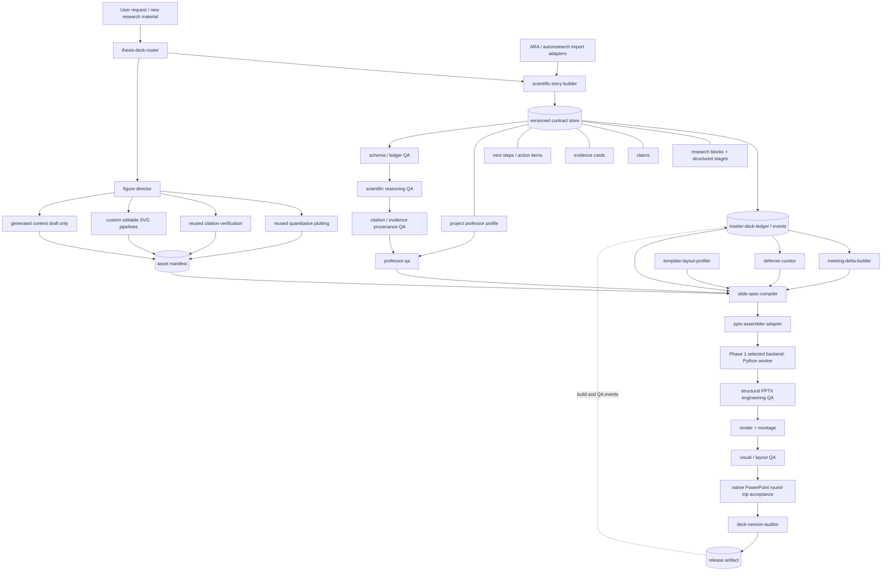

# IMPLEMENTATION REPORT

## 1. Repository audit

### Objective and scope

Phase 0 audited the repository and defines an implementation architecture for a cumulative thesis presentation system. No production system, custom skill, schema, fixture, presentation, or generated asset was implemented. This report is the only Phase 0 artifact and the work must remain at `awaiting_review` until the reviewer returns `APPROVE`, `REVISE`, or `REJECT`.

### Current relevant directory structure

The branch contains 98 `SKILL.md` files across 23 numbered categories. The relevant subset is:

```text
AI-Research-SKILLs/
├── 0-autoresearch-skill/
│   ├── SKILL.md
│   ├── references/
│   │   ├── agent-continuity.md
│   │   ├── progress-reporting.md
│   │   └── skill-routing.md
│   └── templates/
│       ├── findings.md
│       ├── progress-presentation.html
│       ├── research-log.md
│       └── research-state.yaml
├── 20-ml-paper-writing/
│   ├── academic-plotting/
│   │   ├── SKILL.md
│   │   └── references/
│   │       ├── data-visualization.md
│   │       ├── diagram-generation.md
│   │       └── style-guide.md
│   ├── ml-paper-writing/
│   │   └── references/citation-workflow.md
│   └── presenting-conference-talks/
│       ├── SKILL.md
│       └── references/slide-templates.md
├── 22-agent-native-research-artifact/
│   ├── compiler/
│   │   ├── SKILL.md
│   │   └── references/
│   │       ├── ara-schema.md
│   │       ├── exploration-tree-spec.md
│   │       └── validation-checklist.md
│   ├── research-manager/
│   │   ├── SKILL.md
│   │   └── references/
│   │       ├── event-taxonomy.md
│   │       ├── provenance-tags.md
│   │       └── session-protocol.md
│   └── rigor-reviewer/
│       ├── SKILL.md
│       └── references/review-dimensions.md
├── .claude-plugin/marketplace.json
├── .github/workflows/
│   ├── check-inventory.yml
│   ├── publish-npm.yml
│   └── sync-skills.yml
├── docs/
│   ├── SKILL_CREATION_GUIDE.md
│   └── SKILL_TEMPLATE.md
├── packages/ai-research-skills/
│   └── src/
│       ├── agents.js
│       ├── installer.js
│       └── prompts.js
├── scripts/check-inventory.sh
└── thesis-deck-system/
    ├── REVIEW_PROTOCOL.md
    ├── TASK_PHASE_0.md
    └── reports/
        └── PHASE_0_IMPLEMENTATION_REPORT.md
```

No `.pptx`, `.pptm`, `.potx`, `.potm`, legacy `.ppt`, or `.odp` file is present. There is no NCKU/AMPL template, laboratory deck, slide render fixture, OpenXML profiler, PptxGenJS implementation, Draw.io asset, or PowerPoint engineering test. The root `package.json` has only a deliberately failing placeholder `test` script; current CI validates inventory and publishing/synchronization behavior, not presentation output.

### Existing skill conventions

Repository conventions that the new category should follow:

- A discoverable skill is a directory containing `SKILL.md` with YAML frontmatter: kebab-case `name`, third-person trigger-oriented `description`, semantic `version`, `author`, `license`, tags, and direct dependencies.
- `SKILL.md` is the concise routing/workflow layer. Detailed material belongs one level down in `references/`; deterministic work belongs in `scripts/`; reusable examples or templates belong in `assets/` or `templates/`.
- Workflows use explicit checklists and validate-fix-repeat feedback loops. Critical actions should be executed by scripts rather than left to unconstrained prose.
- Paths inside skills use `/`, references remain one level deep, and outputs have concrete input/output examples.
- Numbered top-level categories are wired into several registries: `.claude-plugin/marketplace.json`, `packages/ai-research-skills/src/prompts.js`, installer category lists, README/WELCOME inventory text, and inventory CI. Adding skills without updating all relevant registries creates installation and count drift.
- `.github/workflows/sync-skills.yml` currently recognizes numbered two-digit category paths. A new `23-thesis-deck-system/` category fits that convention; placing installable skills only under the unnumbered task directory would bypass automatic skill synchronization.

### Existing reusable components

| Existing component | Reuse decision | Reusable behavior | Required adaptation |
|---|---|---|---|
| `0-autoresearch-skill` | Reuse concepts, not its workspace schema verbatim | Two-loop research operation, hypothesis/experiment tracking, negative-result discipline, Git milestone protocol, progress reporting | The thesis system needs stable research-block IDs, scientific-method stages, deck projections, and an append-only event cursor rather than one mutable `research-state.yaml` |
| ARA `research-manager` | Reuse provenance vocabulary and append discipline | `user`, `ai-suggested`, `ai-executed`, `user-revised`; session/event extraction; append rather than overwrite; decisions, experiments, dead ends, pivots | Presentation state must be recorded during explicit ledger operations, not only as a post-task epilogue; provenance must extend to claims, assets, slide assertions, and curation decisions |
| ARA `compiler` | Reuse evidence fidelity and claim/proof linkage | Raw vs derived evidence distinction, exact-source identifiers, claims bounded by evidence, progressive disclosure, evidence index | Replace paper-centric ARA files with project research blocks and typed evidence cards; keep source checksum, locator, extraction method, and transformation chain |
| ARA `rigor-reviewer` | Reuse epistemic dimensions | Evidence relevance, falsifiability, scope calibration, argument coherence, exploration integrity, methodological rigor | Add the mandated Scientific Method sequence, explicit discussion questions, slide-level claim coverage, professor-style decision gates, and presentation-specific severities |
| `academic-plotting` quantitative workflow | Reuse and harden | Matplotlib/seaborn chart selection, script retention, vector export, PNG preview, accessibility considerations | Remove the assumption that “boxes and arrows” should directly become a Gemini raster. Require editable SVG for mechanisms/setups and carry dataset hash, units, uncertainty, and plotting script in the asset manifest |
| `ml-paper-writing` citation workflow | Reuse | Search, existence verification, BibTeX retrieval, claim validation, consistent citation keys | Add figure-level provenance: source page/figure, license/usage notes, crop bounds, extraction checksum, and a prohibition on generated substitutes for literature evidence |
| `presenting-conference-talks` | Reuse narrative heuristics only | Takeaway-first titles, figure-led slides, speaker notes, timing, editable PPTX intent | It produces generic paper talks, has no cumulative ledger, no meeting/defense view model, no native master profiler, and no render/repair loop |
| `demos/scientific-plotting-demo` | Reuse as style/test inspiration | Reproducible plot scripts with PDF/PNG outputs | It is not schema-driven and has no provenance contract or deck integration |
| Inventory/sync CI | Extend later | Detects skill inventory drift and packages skill folders | Phase 1 should not update public installation metadata until the architecture slice passes local fixtures; later phases must update every registry atomically |

### Conflicts and duplication risks

1. **Two competing research sources of truth.** Autoresearch state, ARA files, and a new deck ledger could diverge. The proposed system therefore defines one presentation-facing canonical ledger and imports/references ARA/autoresearch entities rather than copying their truth into parallel free-form records.
2. **Dead-end semantics.** ARA treats a `dead_end` as a leaf. Thesis work often learns from a failure and continues. The proposed model keeps a failed experiment immutable, then links a new decision or block with `derived_from`/`triggered_by`; it does not mutate the failure into a successful branch.
3. **Image-generation policy conflict.** The existing academic plotting skill routes architecture diagrams to generated raster images. That conflicts with the required editable-vector policy. Only its quantitative plotting workflow is directly reusable; generated mechanism art may be a labeled draft and must be redrawn before scientific use.
4. **Generic PPTX generation vs native templates.** Existing `python-pptx` examples start from a blank presentation and do not prove master/layout preservation. The assembler must start from a profiled template package and test relationships, placeholders, theme, notes, and round-trip behavior.
5. **Schema duplication across skills.** Contract definitions must live in one versioned schema package. Skills may explain contracts but must not maintain private variants.
6. **Registry drift.** The marketplace, npm prompts, installer category lists, README counts, and sync workflow are partly hard-coded. Production skill registration must be a single reviewed change after the new category is stable.
7. **Mutable binary noise.** Committing every regenerated PPTX can make review opaque. Canonical text contracts, event logs, source assets, and checksums should drive reproducible binaries; binary outputs are release artifacts with manifest bindings, not the only history.

## 2. Proposed architecture

### Evaluated approaches

| Approach | Strength | Failure mode | Decision |
|---|---|---|---|
| One monolithic thesis-to-PPT skill | Simple discovery and invocation | Mixes research truth, graphics, layout, assembly, and QA; hard to test; encourages one-shot regeneration | Reject |
| Independent skills sharing loose Markdown | Matches repository style and is easy to add incrementally | Contract drift and ambiguous ownership; meeting/defense views can silently rewrite history | Reject |
| Contract-first multi-skill system over a canonical event ledger | Clear boundaries, deterministic projections, independent QA, reversible curation, reusable tooling | More initial schema and fixture work; requires disciplined migrations | **Recommend** |

### Module/skill diagram



### Responsibilities and boundaries

| Custom skill/module | Owns | Must not own |
|---|---|---|
| `thesis-deck-router` | Request classification, precondition checks, orchestration order, tool routing, stop/approval gates | Research content, slide geometry, or direct PPTX mutations |
| `scientific-story-builder` | Research blocks; first-class research questions; Claim entities; structured metadata for all eight Scientific Method stages; literature synthesis; evidence links; Discussion; and first-class Next Steps/action items | Binary assets, slide placement, rendering, or inferring canonical QA fields from prose |
| `master-deck-ledger` | Stable IDs, immutable event append, materialized current state, research-status transitions, independent story-visibility changes, commitment history, projection cursors, migrations | Editorial rewriting or PowerPoint package operations |
| `figure-director` | Asset-type decision tree, provenance requirements, dispatch to plot/vector/extraction/generation tools, asset registration | Changing numerical evidence, redrawing literature evidence, slide layout |
| `template-layout-profiler` | OpenXML inventory of themes, masters, layouts, placeholders, fonts, color roles, geometry, and allowed layout recipes | Flattening a template or rebuilding its visual identity from screenshots |
| `slide-spec-compiler` | Convert validated research blocks and assets into deterministic typed slide specs; select native layout and content recipe | Direct PPTX XML writes or scientific reinterpretation |
| `pptx-assembler` | Define a backend-neutral assembler interface and materialize slide specs through the one backend selected for a phase | Choosing claims, inventing assets, passing its own QA, or implementing parallel PPTX stacks in Phase 1 |
| `science-evidence-qa` | Scientific-method completeness, claim/evidence entailment, scope, uncertainty, citation and asset provenance | Aesthetic preferences |
| `professor-qa` | Evaluate observation-to-next-step flow, mechanism/assumption logic, decision gates, commitments, timing, cumulative history, and meeting closure against a versioned project `professor-profile.yaml` | Hard-coded generic academic taste, pixel-level layout, or package repair |
| `slide-visual-qa` | Render, montage, overflow/collision/readability checks, hierarchy and density checks, repair requests | Editing evidence or approving broken PPTX relationships |
| `meeting-delta-builder` | A dated projection over blocks, decisions, and action items: prior commitments, completion/closure evidence, blockers, changes, current decisions, next timing, and parallel workstreams | A separately authored research narrative or loss of unfinished commitments at cursor boundaries |
| `defense-curator` | Reversible inclusion/order rationale for defense, with source block/revision bindings and backup-slide policy | Deleting or mutating master history |
| `deck-version-auditor` | Final manifest/package consistency, checksums, slide IDs, source revision bindings, QA closure, OpenXML integrity, and deck-to-deck semantic diff before release | Scientific approval, visual taste, or replacing earlier gates |

The proposed design merges the candidate `shi-scientific-method`, `research-block-builder`, and `evidence-card-builder` into `scientific-story-builder` because research block, Claim, stage metadata, evidence links, and Next Step/action-item updates must validate atomically. Claim, Evidence Card, and Action Item remain first-class contracts even though one skill coordinates them. It merges mechanism, setup, plot, and literature figure directors into one `figure-director` with strict route-specific references/scripts; their shared responsibility is classification and provenance, while execution remains tool-specific. It merges `ncku-template-profiler` and `lab-layout-director` into `template-layout-profiler` because layout recipes are valid only relative to profiled native masters/placeholders. It keeps scientific, provenance, professor, structural engineering, visual, native acceptance, and final version review separate so one pass cannot mask another failure.

### Custom versus reused

- **Reuse directly:** repository skill format; ARA provenance tags; raw/derived evidence distinction; citation verification sequence; quantitative chart-selection guidance; Matplotlib vector export; inventory validation pattern.
- **Reuse through adapters:** autoresearch hypotheses/experiments and ARA claims/exploration nodes. Imports retain external IDs and source paths; they do not become authoritative until normalized into ledger events with provenance.
- **Custom:** canonical schemas including Claim, stage, Action Item, and Professor Profile; ledger/event store; independent research-status and story-visibility events; Scientific Method validators; asset policy router; template/OpenXML profiler; slide-spec compiler; assembler adapter; meeting/defense projection queries; render loop; professor QA; PPTX engineering and final version audits.
- **Explicitly not reused:** Gemini-generated architecture diagrams as final scientific figures; blank-deck presentation templates; paper-talk slide-count formulas as Master Deck structure; free-form Markdown as the sole machine interface.

### Routing logic

1. **Classify the request.** `ingest_research`, `update_block`, `register_asset`, `build_master`, `build_meeting`, `build_defense`, `audit`, or `repair`.
2. **Load the ledger cursor and schemas.** Refuse writes when schema versions are unsupported or the event log fails integrity checks.
3. **Normalize research content.** Create or revise a stable block, its research question, Claim records, structured stage metadata, literature synthesis, evidence bindings, Discussion, and first-class Next Steps/action items through append events. Narrative Markdown is optional presentation prose, never the sole source for QA fields.
4. **Route every asset independently.** Apply the Section 7 decision tree and register checksums, source lineage, editability, evidence role, and Claim bindings.
5. **Select a projection.** Master uses all eligible block revisions and independent story visibility; meeting queries block changes plus unfinished/prior commitments; defense uses explicit curation. All projections retain block, Claim, evidence, action, and decision IDs.
6. **Run the canonical release pipeline in exactly this order:** schema/ledger integrity → scientific reasoning → citation/evidence provenance → professor-style logic using the project profile → compile/assemble PPTX → structural PPTX engineering QA → render/montage visual QA → native PowerPoint round-trip acceptance → final deck/version audit → release.
7. **Assemble through one adapter/backend.** The compiler emits backend-neutral slide specs. Phase 1 selects one Python PPTX worker behind `PptxAssembler`; it does not implement PptxGenJS in parallel. The source template remains immutable and full slides are never rasterized.
8. **Repair from the owning source.** Contract repairs rerun steps 1–10; slide-spec/assembly repairs rerun steps 5–10; structural repairs rerun steps 5–10 after correcting the assembler/package source; visual repairs modify source specs/recipes and rerun steps 5–10; native-round-trip fixes rerun steps 5–10. No repair patches only a rendered PNG or skips the final audit/release decision.
9. **Publish only after all blocking findings close.** Record build ID, input cursor, hashes, professor-profile version, template-profile version, backend/tool versions, QA report IDs, output paths, and release decision. Append the build/release events to the ledger.
10. **Stop at phase/reviewer gates.** Architecture or schema migrations and major phase transitions require reviewer approval.

### Phase 1 runtime/tool boundary

- **Canonical control plane:** one Python package/CLI owns JSON Schema validation, ledger append/replay, projections, slide-spec compilation, QA orchestration, and the assembler interface. Choosing Python avoids a second orchestration runtime in the vertical slice and directly supports the required plotting and initial template-preserving worker.
- **Workers:** Matplotlib and literature/image processing run as Python modules invoked by the control plane. The Phase 1 PPTX worker is also Python and is the only PPTX implementation in that phase.
- **Assembler adapter:** `PptxAssembler.assemble(template_path, slide_specs, output_path) -> AssemblyResult` is the stable boundary. Scientific contracts and slide specs contain no `python-pptx`, PptxGenJS, or OpenXML-library-specific types.
- **Future substitution:** a later reviewer-approved backend may implement the same adapter after fixture evidence justifies it. Backend comparison or duplicate implementations are explicitly out of Phase 1 scope.

## 3. Proposed repository structure

No structure below is implemented in Phase 0. The exact proposed production structure is:

```text
23-thesis-deck-system/
├── thesis-deck-router/
│   ├── SKILL.md
│   └── references/routing-table.md
├── scientific-story-builder/
│   ├── SKILL.md
│   └── references/
│       ├── scientific-method-contract.md
│       └── discussion-rubric.md
├── master-deck-ledger/
│   ├── SKILL.md
│   └── references/status-transitions.md
├── figure-director/
│   ├── SKILL.md
│   └── references/
│       ├── asset-routing.md
│       ├── editable-vector-rules.md
│       └── literature-extraction-rules.md
├── template-layout-profiler/
│   ├── SKILL.md
│   └── references/
│       ├── openxml-profile.md
│       └── layout-recipes.md
├── slide-spec-compiler/
│   ├── SKILL.md
│   └── references/slide-spec-contract.md
├── pptx-assembler/
│   ├── SKILL.md
│   └── references/native-template-rules.md
├── science-evidence-qa/
│   ├── SKILL.md
│   └── references/science-gates.md
├── professor-qa/
│   ├── SKILL.md
│   └── references/professor-rubric.md
├── slide-visual-qa/
│   ├── SKILL.md
│   └── references/visual-gates.md
├── meeting-delta-builder/
│   ├── SKILL.md
│   └── references/meeting-query.md
├── defense-curator/
│   ├── SKILL.md
│   └── references/curation-rules.md
└── deck-version-auditor/
    ├── SKILL.md
    └── references/audit-rules.md

packages/thesis-deck-system/
├── pyproject.toml
├── src/thesis_deck_system/
│   ├── cli.py
│   ├── contracts/
│   │   ├── validate.py
│   │   ├── resolve_refs.py
│   │   └── migrate.py
│   ├── ledger/
│   │   ├── append.py
│   │   ├── materialize.py
│   │   ├── project.py
│   │   └── state_machines.py
│   ├── assets/
│   │   ├── classify.py
│   │   ├── register.py
│   │   ├── plot.py
│   │   └── verify_provenance.py
│   ├── template/
│   │   ├── profile_openxml.py
│   │   └── resolve_layout.py
│   ├── slides/
│   │   ├── compile.py
│   │   └── recipes.py
│   ├── pptx/
│   │   ├── assembler.py          # backend-neutral interface
│   │   ├── python_backend.py     # only Phase 1 PPTX backend
│   │   └── package_audit.py
│   ├── views/
│   │   ├── meeting.py
│   │   └── defense.py
│   └── qa/
│       ├── science.py
│       ├── provenance.py
│       ├── professor.py
│       ├── engineering.py
│       ├── visual.py
│       ├── native_acceptance.py
│       └── version_audit.py
└── tests/
    ├── unit/
    ├── integration/
    ├── fixtures/
    └── golden/

thesis-deck-system/
├── schemas/
│   ├── research-block.schema.json
│   ├── scientific-stage.schema.json
│   ├── claim.schema.json
│   ├── evidence-card.schema.json
│   ├── asset-manifest.schema.json
│   ├── next-step.schema.json
│   ├── slide-spec.schema.json
│   ├── deck-manifest.schema.json
│   ├── qa-report.schema.json
│   ├── decision-event.schema.json
│   └── professor-profile.schema.json
├── examples/
│   └── synthetic-project/
│       ├── project.yaml
│       ├── professor-profile.yaml
│       ├── blocks/
│       ├── claims/
│       ├── evidence/
│       ├── actions/
│       └── template/
├── docs/
│   ├── architecture.md
│   ├── data-contracts.md
│   ├── template-ingestion.md
│   └── operations.md
├── TASK_PHASE_0.md
├── REVIEW_PROTOCOL.md
└── reports/
```

Later production registration would modify these existing files together:

```text
.claude-plugin/marketplace.json
README.md
WELCOME.md
CLAUDE.md
packages/ai-research-skills/README.md
packages/ai-research-skills/src/installer.js
packages/ai-research-skills/src/prompts.js
.github/workflows/check-inventory.yml
.github/workflows/sync-skills.yml
```

That registration is intentionally excluded from the smallest Phase 1 slice.

Each actual thesis project generated by the toolkit should use this runtime workspace, which is separate from the skills repository:

```text
thesis-deck/
├── project.yaml
├── professor-profile.yaml
├── ledger/
│   ├── events.jsonl
│   ├── decisions.jsonl
│   └── snapshots/
├── blocks/B001/
│   ├── block.yaml
│   ├── stages/
│   │   ├── observation.yaml
│   │   ├── literature.yaml
│   │   ├── mechanism.yaml
│   │   ├── solution.yaml
│   │   ├── experiment.yaml
│   │   ├── result.yaml
│   │   └── discussion.yaml
│   └── narrative/
│       ├── observation.md
│       ├── literature.md
│       ├── mechanism.md
│       ├── solution.md
│       ├── experiment.md
│       ├── result.md
│       ├── discussion.md
│       └── next-step.md
├── claims/C001.yaml
├── evidence/E001.yaml
├── actions/NS001.yaml
├── assets/
│   ├── source/
│   ├── literature/
│   ├── experiments/
│   ├── plots/
│   ├── diagrams/
│   ├── microscopy/
│   └── generated/
├── templates/
│   ├── source/
│   └── profiles/
├── specs/slides/
├── decks/
│   ├── master/
│   ├── meetings/
│   └── defense/
├── renders/
├── qa/
└── releases/
```

## 4. Data contracts

All contracts use explicit `schema_version`, stable IDs, ISO 8601 UTC timestamps, repository-relative `/` paths, SHA-256 checksums for source/artifact bindings, and conservative provenance. Schemas are JSON Schema documents; YAML is the preferred author-facing serialization, while JSONL is used for immutable event/decision streams.

### Research block

```yaml
schema_version: "1.0.0"
block_id: B001
revision: 4
title: "Surface defects after treatment A"
research_question:
  question_id: RQ-B001
  text: "Does treatment A increase surface-defect density, and is spatial non-uniformity the responsible mechanism?"
  scope: "Samples fabricated with protocol revision 2 at 25 C"
problem_statement: "Defects increased after treatment A, but the causal mechanism and spatial distribution are unresolved."
research_status: failed_but_informative
story_visibility:
  master: main
  meeting: main
  defense: appendix
created_at: "2026-08-20T03:15:00Z"
updated_at: "2026-08-26T08:00:00Z"
provenance: user-revised
parent_block_ids: []
derived_from: []
supersedes: []
superseded_by: []
hypothesis_claim_refs: [C001]
mechanism_claim_refs: [C002]
prediction_claim_refs: [C003]
stage_refs:
  observation: blocks/B001/stages/observation.yaml
  literature: blocks/B001/stages/literature.yaml
  mechanism: blocks/B001/stages/mechanism.yaml
  solution: blocks/B001/stages/solution.yaml
  experiment: blocks/B001/stages/experiment.yaml
  result: blocks/B001/stages/result.yaml
  discussion: blocks/B001/stages/discussion.yaml
  next_step: actions/NS001.yaml
claim_refs: [C001, C002, C003, C004]
evidence_refs: [E001, E002]
asset_refs: [A001, A002]
action_item_refs: [NS001]
decision_refs: [D0007]
decision_criteria_ref: blocks/B001/stages/experiment.yaml#decision_rules
tags: [surface, treatment-a, microscopy]
```

Rules:

- `research_question`, `problem_statement`, at least one `hypothesis_claim_ref`, at least one falsifiable prediction, and decision criteria are required before an Experiment stage can become `ready`.
- Allowed `research_status` transitions are event-driven: `active → resolved | failed_but_informative | superseded`; extendable values require a schema migration. A terminal status may be reopened only by an explicit decision event that creates a new revision.
- `story_visibility` is an independent projection dimension with values `main | appendix | history | hidden_from_default_view` per deck kind. Visibility changes never alter `research_status` and research-status changes never silently alter visibility.
- `superseded` never deletes a block and must name its successor or an unresolved reason.
- Every block references all eight structured stages. Observation through Discussion use `scientific-stage.schema.json`; `next_step` resolves directly to the one canonical `next-step.schema.json` Action Item, so no duplicate block-local Next Step exists. `pending`, `blocked_missing_evidence`, `ready`, and `complete` are valid stage states; absent information is explicit rather than fabricated.
- Discussion records interpretation and selects a `next_step_ref`; it does not duplicate the canonical action, owner, timing, or criteria.

### Scientific stage metadata

Every `scientific-stage.schema.json` record has common fields and a stage-specific `data` object:

```yaml
schema_version: "1.0.0"
stage_id: ST-B001-LIT
block_ref: {block_id: B001, revision: 4}
stage_type: literature
revision: 2
status: complete
claim_refs: [C005, C006]
evidence_refs: [E010, E011, E012]
narrative_ref: blocks/B001/narrative/literature.md
data:
  consensus:
    text: "Treatment-induced defects are sensitive to local transport and surface condition."
    supporting_evidence_refs: [E010, E011]
  disagreements_or_alternatives:
    - text: "One model attributes the effect to chemistry rather than transport non-uniformity."
      supporting_evidence_refs: [E012]
  known_mechanisms:
    - mechanism_claim_ref: C006
      supporting_evidence_refs: [E010]
  research_gap: "Published work does not resolve within-sample spatial variation under this protocol."
  relevance_to_observation: "The observed increase may be an average of spatially localized damage."
  implication_for_hypothesis_or_strategy: "Test spatial position before changing treatment chemistry."
  supporting_literature_evidence_refs: [E010, E011]
  contradicting_literature_evidence_refs: [E012]
provenance: user-revised
created_at: "2026-08-20T03:30:00Z"
updated_at: "2026-08-25T06:00:00Z"
```

For `literature`, the six synthesis fields shown above are required. A source list or a set of evidence references with empty synthesis fields is invalid. Literature synthesis must lead to hypothesis, mechanism, or strategy Claim refs.

The Experiment specialization is fully machine-addressable:

```yaml
schema_version: "1.0.0"
stage_id: ST-B001-EXP
block_ref: {block_id: B001, revision: 4}
stage_type: experiment
revision: 3
status: complete
hypothesis_claim_refs: [C001]
prediction_claim_refs: [C003]
narrative_ref: blocks/B001/narrative/experiment.md
data:
  independent_variables:
    - variable_id: IV1
      name: spatial_position
      levels: [center, mid_radius, edge]
      unit: mm_from_center
  controlled_variables:
    - name: treatment_temperature
      target: 25
      tolerance: 1
      unit: degC
    - name: treatment_duration
      target: 30
      tolerance: 0.5
      unit: min
  controls_baselines:
    - group_id: CTRL-UNTREATED
      description: "Matched specimens without treatment A"
  sample_plan:
    sample_count: 9
    replicate_count_per_level: 3
    count_status: defined
  measured_outputs:
    - metric_id: M1
      name: defect_density
      unit: count/mm^2
      method_ref: METHOD-MICROSCOPY-001
  instrumentation_method_refs: [INST-SEM-01, METHOD-MICROSCOPY-001]
  predicted_outcomes:
    - prediction_claim_ref: C003
      metric_id: M1
      expected_relation: "edge > center"
  decision_rules:
    go:
      expression: "effect_size_edge_vs_center >= 1.0 and ci95_excludes_zero == true"
      decision_ref_on_match: D-TEMPLATE-GO
    partial_go:
      expression: "0 < effect_size_edge_vs_center < 1.0 or ci95_excludes_zero == false"
      decision_ref_on_match: D-TEMPLATE-PARTIAL
    no_go:
      expression: "effect_size_edge_vs_center <= 0"
      decision_ref_on_match: D-TEMPLATE-NOGO
  required_evidence: [EVIDENCE-REQ-SPATIAL-MICROSCOPY]
provenance: user
created_at: "2026-08-21T01:00:00Z"
updated_at: "2026-08-21T01:00:00Z"
```

`sample_count`/`replicate_count_per_level` may be `null` only when `count_status: unknown | not_yet_defined` and the stage is not `ready` or `complete`. Units are required for quantitative variables/metrics. Controls/baselines, at least one measured output, instrumentation or method references, predicted outcomes, and Go/Partial-Go/No-Go rules are required before execution.

The other structured stages require, at minimum:

- `observation`: observed condition, context, source evidence, affected scope, and what is surprising/unknown.
- `mechanism`: mechanism Claim refs, hypothesis Claim refs, assumptions, predictions, falsifying observations, and discriminating evidence requirements.
- `solution`: strategy Claim refs, mechanism linkage, alternatives considered, selection rationale, and risks.
- `result`: experiment ref, observed metrics with values/units/uncertainty, deviations from plan, evidence refs, and data-quality status.
- `discussion`: hypothesis-support state, Claim refs supported/weakened/refuted/revised, failed assumptions, missing evidence, limitations, decision ref, and exactly one selected `next_step_ref` (or an explicit conclusion reason).
- `next_step`: a reference to the canonical Next Step/Action Item contract below; no duplicate prose-only action is authoritative.

### Claim

All `Cxxx` references resolve to a versioned `claim.schema.json` entity:

```yaml
schema_version: "1.0.0"
claim_id: C001
revision: 2
claim_type: hypothesis
text: "Treatment A increases defect density because transport is spatially non-uniform."
block_ref: {block_id: B001, revision: 4}
stage: mechanism
scope:
  population: "Protocol revision 2 specimens"
  conditions: "Treatment A at 25 C for 30 min"
  exclusions: []
epistemic_status: testing
confidence:
  level: medium
  rationale: "Overall increase is observed, but spatial discrimination is pending."
evidence_support_refs: [E001]
evidence_contradict_refs: []
assumptions:
  - assumption_id: AS-B001-01
    text: "Spatial position is a proxy for transport exposure."
falsifiable_predictions:
  - prediction_claim_ref: C003
    observation_that_falsifies: "Defect density does not vary by spatial position within the stated uncertainty."
discriminating_evidence_requirements:
  - requirement_id: EVIDENCE-REQ-SPATIAL-MICROSCOPY
    description: "Position-stratified microscopy with matched untreated controls and n>=3 per position."
provenance: user-revised
supersedes: [C000]
superseded_by: []
created_at: "2026-08-20T03:15:00Z"
updated_at: "2026-08-26T08:00:00Z"
```

Allowed `claim_type` values are `observation | literature_synthesis | hypothesis | mechanism | prediction | strategy | result | discussion | takeaway`. Hypothesis and mechanism Claims require at least one falsifiable prediction or direct `observation_that_falsifies`, plus discriminating evidence requirements. Every Claim reference is validated for existence, stage/block compatibility, revision, and non-superseded use unless historical context is explicit.

### Next Step / action item

`next-step.schema.json` is both the canonical Next Step stage object and the progress-management commitment used by meeting views:

```yaml
schema_version: "1.0.0"
action_item_id: NS001
revision: 2
action_type: experiment
title: "Run position-stratified cross-section microscopy"
action: "Measure defect density at center, mid-radius, and edge with matched untreated controls."
rationale: "This discriminates the transport non-uniformity hypothesis before chemistry changes."
source_decision_ref: D0007
linked_block_refs: [{block_id: B001, revision: 4}]
linked_claim_refs: [C001, C003]
prior_commitment:
  meeting_id: MEETING-2026-08-26
  committed_at: "2026-08-26T08:00:00Z"
owner:
  actor_id: researcher
  display_name: "Primary researcher"
target_window:
  start: "2026-08-27T00:00:00Z"
  due: "2026-09-02T09:00:00Z"
  timezone: Asia/Taipei
actual_completion:
  completed_at: null
  closure_evidence_refs: []
success_failure_criteria:
  success: "All three positions and controls have >=3 valid replicates and calibrated measurements."
  failure: "Any position lacks valid calibration or fewer than 3 usable replicates."
required_evidence: [EVIDENCE-REQ-SPATIAL-MICROSCOPY]
dependency_refs: [NS0008]
blocker_refs: []
parallelizable: true
workstream: microscopy
status: planned
result_summary: null
supersedes: []
superseded_by: []
provenance: user
created_at: "2026-08-26T08:00:00Z"
updated_at: "2026-08-26T08:00:00Z"
```

Allowed status values are `planned | in_progress | blocked | done | cancelled | superseded`. `done` requires `actual_completion.completed_at` and closure evidence or an explicit non-evidentiary completion rationale. A meeting projection carries unfinished commitments forward until closure/cancellation/supersession and answers assignment, completion, change/failure, next action, expected timing, blockers, and parallel workstreams.

### Evidence card

```yaml
schema_version: "1.0.0"
evidence_id: E001
kind: experimental_measurement
title: "Defect density after treatment A"
provenance: user
source:
  source_id: SRC-EXP-2026-08-19-01
  uri: assets/source/2026-08-19/defect_counts.csv
  sha256: "<64-lowercase-hex>"
  acquired_at: "2026-08-19T06:30:00Z"
  owner: "AMPL"
  locator:
    sample_ids: [S01, S02, S03]
extraction:
  method: direct_file
  tool: null
  transformations: []
claim_support_refs: [C001]
claim_contradict_refs: []
scope:
  population: "Samples S01-S03 under treatment A"
  conditions: "25 C; protocol revision 2"
  exclusions: []
measurement:
  metric: defect_density
  unit: "count/mm^2"
  uncertainty: "mean and sample standard deviation; n=3"
license_or_usage: internal_research
verification:
  status: verified
  verified_by: user
  verified_at: "2026-08-20T04:00:00Z"
```

Evidence cards distinguish `experimental_measurement`, `literature_claim`, `literature_figure`, `observation_photo`, `microscopy_image`, `simulation_output`, and `generated_context`. Every Claim reference must resolve to `claim.schema.json`. `generated_context` is never allowed in `claim_support_refs` or `claim_contradict_refs` and must carry `evidence_role: decorative_only` in its asset record.

### Asset manifest

```yaml
schema_version: "1.0.0"
asset_id: A001
asset_type: data_plot
title: "Defect density: control vs treatment A"
evidence_role: quantitative_evidence
source_evidence: [E001]
source_assets: []
path: assets/plots/A001_defect_density.svg
preview_path: assets/plots/A001_defect_density.png
mime_type: image/svg+xml
sha256: "<64-lowercase-hex>"
editable: true
generator:
  kind: matplotlib
  script: assets/plots/A001_defect_density.py
  script_sha256: "<64-lowercase-hex>"
  version: "3.10.x"
  parameters:
    width_in: 7.2
    height_in: 4.0
transform_chain:
  - input_sha256: "<64-lowercase-hex>"
    operation: "group_by condition; compute mean and sample SD"
    output_sha256: "<64-lowercase-hex>"
provenance: ai-executed
citation_refs: []
license_or_usage: internal_research
accessibility:
  alt_text: "Treatment A has higher mean defect density than control; error bars show sample SD."
  colorblind_checked: true
status: approved
```

The asset policy rejects missing source hashes, generated images labeled as evidence, a literature crop without source locator/citation, quantitative plots without code/data lineage, and mechanism/setup diagrams marked non-editable unless a documented exception is approved.

### Slide spec

```yaml
schema_version: "1.0.0"
slide_id: S-B001-RESULT-01
revision: 2
deck_role: research_block
block_refs:
  - block_id: B001
    revision: 4
stage: result
native_layout:
  template_profile_id: TP-NCKU-001
  master_id: master-1
  layout_id: layout-hero-plot
recipe: hero_plot_discussion
title:
  text: "Treatment A increased defects; uniformity assumption is not supported"
  assertion_claim_refs: [C001]
placements:
  - slot: hero_visual
    asset_id: A001
    fit: contain
  - slot: discussion
    content_ref: blocks/B001/narrative/discussion.md#summary
    max_lines: 5
citations: []
speaker_notes:
  source_refs: [E001, D0007]
  text: "State the failed assumption before proposing the next measurement."
provenance_badges:
  enabled: true
  refs: [E001]
story_visibility:
  master: main
  meeting: main
  defense: appendix
selection_policy:
  meeting: include_if_changed
  defense: candidate
source_cursor: 128
```

Slide specs contain semantic slots rather than arbitrary coordinates when a native placeholder exists. Explicit coordinates are allowed only in the selected recipe and are expressed in normalized template coordinates. Every takeaway assertion points to claim IDs; every evidence-bearing placement points to approved asset IDs.

### Deck manifest

```yaml
schema_version: "1.0.0"
deck_id: MASTER-2026-08-26-001
deck_kind: master
title: "Master's Thesis Research — Master Deck"
template_profile_id: TP-NCKU-001
professor_profile_ref: {profile_id: PROF-AMPL-001, version: "1.0.0"}
source_event_cursor: 128
build_id: BUILD-2026-08-26T090000Z
build_tool_version: "0.1.0"
created_at: "2026-08-26T09:00:00Z"
projection:
  query: "master(all_blocks, preserve_history=true)"
  previous_deck_id: MASTER-2026-08-19-001
slides:
  - ordinal: 1
    slide_id: S-TITLE-01
    spec_revision: 1
    story_visibility: main
  - ordinal: 12
    slide_id: S-B001-RESULT-01
    spec_revision: 2
    story_visibility: main
  - ordinal: 13
    slide_id: S-B000-OLD-MECH-01
    spec_revision: 3
    story_visibility: history
outputs:
  pptx: decks/master/master_deck.pptx
  pptx_sha256: "<64-lowercase-hex>"
  pdf: decks/master/master_deck.pdf
qa_report_refs: [QA-BUILD-2026-08-26T090000Z]
```

Meeting and defense manifests add `base_master_deck_id` and a projection/curation reference. Their slide records retain the original `slide_id` and `spec_revision`; deck-local interstitial slides receive their own stable IDs.

### QA report

```yaml
schema_version: "1.0.0"
qa_report_id: QA-BUILD-2026-08-26T090000Z
build_id: BUILD-2026-08-26T090000Z
deck_id: MASTER-2026-08-26-001
created_at: "2026-08-26T09:10:00Z"
overall_status: fail
professor_profile_ref: {profile_id: PROF-AMPL-001, version: "1.0.0"}
pipeline:
  - {order: 1, stage: schema_ledger_integrity, status: pass}
  - {order: 2, stage: scientific_reasoning, status: fail}
  - {order: 3, stage: citation_evidence_provenance, status: not_run}
  - {order: 4, stage: professor_style_logic, status: not_run}
  - {order: 5, stage: compile_assemble_pptx, status: not_run}
  - {order: 6, stage: structural_pptx_engineering, status: not_run}
  - {order: 7, stage: render_montage_visual, status: not_run}
  - {order: 8, stage: native_powerpoint_round_trip, status: not_run}
  - {order: 9, stage: final_deck_version_audit, status: not_run}
  - {order: 10, stage: release, status: blocked}
findings:
  - finding_id: QF-001
    gate: scientific_reasoning
    severity: critical
    slide_id: S-B001-RESULT-01
    block_id: B001
    rule_id: SCI-DISCUSSION-MISSING-EVIDENCE
    message: "The discussion claims mechanism support but E001 only establishes correlation."
    evidence_refs: [E001]
    repair_action: "Narrow the claim or add a mechanism-discriminating experiment."
    status: open
artifacts:
  render_dir: null
  montage: null
tool_versions:
  renderer: "recorded-at-runtime"
```

Any `critical` finding fails the build. Gate-specific major findings also fail release. A failed/not-run upstream stage leaves downstream stages `not_run` and release `blocked`; it never records an apparent downstream pass. Warnings may pass only with a recorded decision and must remain visible in the next audit. The QA report records rerun provenance for every repair.

### Decision / event log

One JSON object is appended per line to `ledger/decisions.jsonl`:

```json
{"schema_version":"1.0.0","decision_id":"D0007","timestamp":"2026-08-26T08:00:00Z","actor":{"type":"user","id":"researcher"},"decision_type":"research_gate","subject_refs":["B001","C001","E001"],"choice":"partial_go","alternatives":["go","no_go"],"rationale":"The effect is reproducible but the uniformity mechanism is not established.","evidence_refs":["E001"],"triggered_by":["EVT-0126"],"supersedes":null,"provenance":"user","event_hash":"<sha256-of-canonical-record>"}
```

`decision-event.schema.json` validates both decision records and domain events such as `block_created`, `claim_revised`, `stage_revised`, `evidence_linked`, `research_status_changed`, `story_visibility_changed`, `action_committed`, `action_status_changed`, `action_closed`, `slide_spec_compiled`, `qa_finding_recorded`, and `deck_released`. `research_status_changed` and `story_visibility_changed` are different event types with different state machines.

Required invariants are unique monotonic cursors, immutable prior lines, canonical serialization for hashing, explicit actor/provenance, real alternatives, evidence/rationale for scientific gates, referential integrity to Blocks/Claims/Evidence/Actions, and `supersedes` links for corrections. Corrections append a new decision/event; they never edit history.

### Professor profile

`professor-profile.schema.json` defines a versioned project input consumed by `professor-qa`; the skill supplies validation logic but not immutable taste:

```yaml
schema_version: "1.0.0"
profile_id: PROF-AMPL-001
version: "1.0.0"
project_id: THESIS-AMPL-001
primary_language: zh-TW
technical_term_policy: "English technical terminology may remain English."
narrative_rules:
  scientific_method_required: true
  one_logical_block_at_a_time: true
  require_question_before_data: true
  require_mechanism_or_hypothesis_context: true
  literature_must_synthesize_to_hypothesis_or_strategy: true
  discussion_must_update_decision: true
  preserve_failed_and_changed_hypotheses: true
  persistent_orientation_view: fishbone_or_research_map
meeting_rules:
  require_previous_commitments: true
  require_completion_and_closure_evidence: true
  require_current_progress: true
  require_next_steps_and_timing: true
  require_blockers_dependencies_and_parallel_work: true
master_deck_rules:
  cumulative_growth: true
  meeting_and_defense_are_projections: true
content_rules:
  figures_dominate: true
  text_supports_interpretation: true
  high_density_allowed_only_when_structured: true
visual_exemplars:
  template_language_refs: [EXEMPLAR-1, EXEMPLAR-3]
  content_layout_primary_ref: EXEMPLAR-2
  native_pptx_required_for_profile: true
font_policy:
  final_fonts_locked: false
  required_fonts: []
  fallback_fonts: []
  source: pending_template_profile
change_log:
  - version: "1.0.0"
    source: "Phase 0 architecture reviewer decisions"
    decision_refs: [D-PROFILE-0001]
provenance: user
created_at: "2026-08-27T00:00:00Z"
updated_at: "2026-08-27T00:00:00Z"
```

Profile revisions append a decision/event and preserve prior versions so old deck releases remain reproducible. Scientific correctness rules stay in science/provenance QA; exemplar-derived composition and density thresholds live in the Professor Profile or Template Profile. The first and third exemplar decks define template language, while the second is the primary content-layout/figure-composition reference. Actual private PPTX files are required before visual-fidelity acceptance and are not committed without permission.

## 5. Master Deck strategy

### Canonical history

The source of truth is the append-only ledger plus immutable source assets. Human-friendly block files and manifests are materialized views at a ledger cursor. Git provides repository-level forensic history, while the event log supplies domain semantics that a binary diff cannot.

Each research block, Claim, stage record, Evidence Card, and Action Item has a stable ID and revision. Updates append events such as `block_created`, `claim_revised`, `stage_revised`, `evidence_linked`, `research_status_changed`, `story_visibility_changed`, `action_committed`, `action_closed`, `block_superseded`, `decision_recorded`, `slide_spec_compiled`, and `deck_built`. Events include previous/new revision, actor, provenance, timestamp, payload hash, and causal links. A snapshot accelerates reads but is disposable and must reproduce from the event stream.

### Failed experiments and superseded hypotheses

- A failed experiment is stored as result evidence plus `research_status: failed_but_informative`. Its structured Discussion records the failed assumption, missing evidence, lesson, and decision; its selected `next_step_ref` resolves to the canonical Action Item.
- A superseded hypothesis remains addressable. The successor links back with `supersedes`, while the old block records `superseded_by` through a later event.
- Research lifecycle and presentation curation are orthogonal. `research_status` expresses `active | resolved | failed_but_informative | superseded`; `story_visibility` expresses `main | appendix | history | hidden_from_default_view` per deck projection. A failed block may remain `main`; a resolved block may be hidden from a weekly meeting without changing its research status.
- A mechanism-evolution slide can query successive block/claim revisions and show why each transition occurred.
- No operation deletes a block through the normal CLI. Exceptional legal/privacy removal requires a separate destructive protocol outside routine deck generation.

### Master Deck materialization

The Master Deck is a deterministic release built from a specified ledger cursor, template profile, and ordered slide specs. The deck manifest records those inputs and hashes the output. New research normally appends or revises a bounded block section; unchanged slide IDs retain their semantic identity even if ordinals shift.

Story visibility has four presentation states independent of research status:

1. `main`: visible in the current cumulative story.
2. `appendix`: included as backup/supporting material.
3. `history`: explicitly presented as prior, failed, or superseded context.
4. `hidden_from_default_view`: omitted from a default binary view but retained in the ledger/spec store and reproducible through an explicit query.

The ledger, not the current PPTX, decides whether history exists. This prevents accidental loss when a user manually removes or hides a slide.

### Meeting views

A meeting deck is a query over a chosen Master Deck cursor:

- previous meeting commitments, owners, target windows, and their status at the current cursor,
- actual completion dates and closure evidence for completed work,
- blocked/cancelled/superseded actions with reasons, dependencies, and linked decisions,
- blocks/events added or materially changed since the previous meeting cursor,
- unresolved critical evidence gaps,
- current go/partial-go/no-go decisions,
- next actions, owners, timing, and work that can run in parallel.

The meeting builder carries each prior commitment forward until `done`, `cancelled`, or `superseded`; a cursor boundary cannot make unfinished work disappear. It produces deterministic answers to: what was assigned, what completed, what changed/failed, what is next, when the next result is expected, and what can run in parallel. It selects existing slide specs where possible and may create meeting-only agenda, commitment-delta, or decision slides, but these cite source Block/Claim/Action/Event IDs and do not rewrite scientific content. The meeting manifest stores `base_master_deck_id`, start/end cursors, query parameters, included action revisions, and selected slide revisions.

### Defense curation

Defense curation is a reversible selection layer, not a new truth store. A versioned `defense-curation.yaml` records each included/excluded block or slide, reason, target section, desired depth, and backup status. The defense deck may compress or synthesize multiple blocks only through new slide specs whose assertions and assets still bind to original claims/evidence. Failed work can be omitted from the main defense story for time but remains available as backup when it explains a design choice or limitation.

## 6. Slide/template strategy

### Template acquisition and profiling

The source lab templates are private/local immutable inputs. The first and third exemplar decks define the Master/template visual language; the second exemplar is the primary reference for content layout and figure composition. Screenshots may inform discussion but never serve as a basis for recreating native layouts. Profiling operates on copies of the actual PPTX files and unzips the PPTX Open Packaging Convention archive to inspect:

- `ppt/presentation.xml` and relationships;
- all `ppt/slideMasters/`, `ppt/slideLayouts/`, `ppt/theme/`, and their relationship files;
- layout names, master/layout IDs, placeholder types/indexes, inheritance, geometry, margins, default text styles, theme colors, theme fonts, background objects, logos, and footer/date/slide-number behavior;
- slide size, notes masters, embedded fonts/media, chart/workbook relationships, custom XML, and extension lists;
- representative existing slides that demonstrate laboratory layout usage.

The profiler emits a versioned `template-profile.json` plus rendered contact sheets. The profile maps stable semantic roles such as `title`, `section`, `hero_plot`, `two_column`, `full_bleed_image`, and `blank_native` to real master/layout IDs and placeholder slots. It records Traditional Chinese (`zh-TW`) as the primary language, permits English technical terminology, and records required/fallback fonts discovered from the template; final fonts remain unlocked until that profiling occurs. A human reviews ambiguous mappings once; subsequent builds use the approved profile and the project Professor Profile.

### Preserving native PowerPoint behavior

- Assembly starts by copying the approved source template; it does not create a blank deck and approximate the theme.
- New slides are instantiated from existing native layouts and keep their `r:id` relationship to the original layout/master.
- Native placeholders are filled when available. Added shapes are used only for content the layout does not expose, and remain editable PowerPoint text/shapes or embedded editable SVG.
- Theme colors/fonts are referenced through semantic roles where the tooling permits; literal fallback values come from the profile and are audited.
- Existing logos, backgrounds, footer fields, slide numbers, notes, and section behavior remain inherited rather than rasterized.
- An OpenXML bridge handles features not safely exposed by the high-level library. It must make minimal package edits, preserve unknown extension XML, update content types/relationships correctly, and run a package integrity audit afterward.
- Phase 1 implements one Python PPTX worker only, behind the backend-neutral `PptxAssembler` adapter described in Section 2. It does not implement or benchmark PptxGenJS in parallel. A later backend change requires reviewer approval and fixture evidence but does not change scientific contracts or slide specs.
- PowerPoint or LibreOffice opening is an integration check, not proof of fidelity. Relationship inspection and native PowerPoint rendering are both required for the reference lab template.
- Native PowerPoint availability/version is detected and reported rather than assumed. LibreOffice may provide interim secondary renders; real-template acceptance remains blocked until native Windows PowerPoint round-trip evidence is available.
- Canonical Git history contains schemas, ledger/events, scripts, allowed source assets, manifests, Professor/Template Profiles, and provenance. Generated PPTX/PDF/renders are build/release artifacts by default. Private laboratory templates are never committed without explicit permission.

### Layout recipes

Recipes implement the recurring layouts from the task as semantic slot maps layered on approved native layouts: photo + observation, photo + schematic, control vs treatment, observation | mechanism | solution, literature + mechanism, hero plot + discussion, microscopy hero + matrix, experiment matrix, process flow, measurement setup, hypothesis, fishbone/research map, decision gate, timeline/to-do, failure analysis, and mechanism evolution.

Each recipe declares minimum/maximum asset count, allowed asset types, text budgets, aspect-ratio expectations, citation zone, discussion zone, speaker-note requirements, and fallback behavior. Recipe selection is deterministic from the slide intent and available validated content. Overflow produces a compiler error or an explicit multi-slide split; it never silently shrinks text below the approved threshold.

## 7. Figure-generation routing

```text
START: What does the asset assert?
│
├─ Numerical relationship derived from experimental/simulation data?
│  └─ DATA PLOT
│     → require evidence card, raw-data checksum, units, uncertainty policy
│     → generate with saved Matplotlib script
│     → export editable/vector SVG or PDF plus PNG preview
│     → compare plotted values against source data before approval
│
├─ Proposed causal mechanism or conceptual architecture?
│  └─ MECHANISM DIAGRAM
│     → create editable SVG with stable object IDs and exact terminology
│     → bind claims/assumptions to diagram elements
│     → generated imagery allowed only as a labeled draft/reference
│     → final evidence-bearing version must be redrawn and reviewed
│
├─ Physical apparatus, fabrication flow, or measurement configuration?
│  └─ EXPERIMENTAL SETUP
│     → prefer editable SVG/Draw.io-style vector over illustration
│     → distinguish measured path, control path, sample, instrument, and flow direction
│     → include model/part identifiers only from verified records
│     → use a source photo as a linked inset when spatial fidelity matters
│
├─ Figure originates in a publication or external report?
│  └─ LITERATURE FIGURE
│     → retrieve the original source; verify citation/identifier
│     → extract/crop without semantic recreation
│     → record page, figure number, caption, crop bounds, checksum, and usage notes
│     → if unavailable or illegible, block and request source; never hallucinate a substitute
│
├─ Camera/microscope image from the project?
│  └─ MICROSCOPY / PHOTO
│     → preserve original file and metadata/checksum
│     → create non-destructive derivative for crop, contrast, scale bar, labels, or montage
│     → record every transformation; prohibit misleading enhancement
│     → microscopy requires verified scale/calibration when quantitative size is asserted
│
└─ Pure context, cover art, or non-evidentiary analogy?
   └─ GENERATED CONTEXTUAL ILLUSTRATION
      → image generation permitted
      → mark `generated_context`, `decorative_only`, and model/prompt provenance
      → visually separate it from experimental/literature evidence
      → prohibit use as proof, measurement, microscopy, apparatus documentation, or source figure
```

Mixed assets are decomposed. For example, a literature figure beside a newly drawn mechanism remains two asset records with separate provenance, even if a slide visually groups them. A plot overlaid on a microscopy image retains both source records and a transform manifest.

## 8. QA gates

All builds use one canonical pipeline. Each stage records status in the QA report; downstream stages remain `not_run` after an upstream blocker. Passing a later stage cannot waive an earlier failure.

### Stage 1 — schema and ledger integrity

- Validate every Block, Stage, Claim, Evidence Card, Asset Manifest, Action Item, Slide Spec, Deck Manifest, QA Report, Decision/Event, Professor Profile, and Template Profile against its declared schema version.
- Reject dangling IDs, including every unresolved `Cxxx` Claim reference; verify revision compatibility and explicit historical use of superseded Claims.
- Verify event hash chain, monotonic cursors, legal research-status transitions, separate story-visibility transitions, action-state transitions, file existence, and SHA-256 bindings.
- Rebuild materialized state from events and compare it with the checked-in snapshot; block on unknown schema versions or history gaps.

### Stage 2 — scientific reasoning

- Verify each block has an exact research question, problem statement, explicit hypothesis/mechanism Claims, falsifiable predictions, discriminating evidence requirements, and decision criteria.
- Verify the eight structured stages in order: `Observation → Literature → Mechanism → Solution/Strategy → Experiment → Result → Discussion → Next Step`.
- Reject Literature that only lists sources; require consensus, disagreement/alternatives, known mechanisms, gap, relevance to observation, and implications for hypothesis/strategy.
- Validate Experiment variables, controls/baselines, samples/replicates, metrics/units, instrumentation/methods, predictions, and Go/Partial-Go/No-Go rules from schema-backed metadata.
- Require Discussion to state support/not-support, failed assumptions, missing evidence, limitations, decision, and one selected Next Step reference without duplicating its canonical action data.
- Detect causal claims supported only by correlation, universal claims from narrow samples, metric/Claim mismatch, and contradiction with failed/superseded branches.

### Stage 3 — citation and evidence provenance

- Resolve every Claim, number, caption, and evidence-bearing asset to verified Evidence Cards.
- Verify paper identity and source locator; distinguish raw source figure/table from derived subset.
- Compare plot values/units with source data and verify script/data/output hashes.
- Confirm microscopy transformations are non-destructive and scale bars/calibration are sourced.
- Reject generated imagery as experimental or literature evidence and reject uncited/unlicensed external figures.

### Stage 4 — professor-style logic

- Load the exact `professor-profile.yaml` version recorded by the Deck Manifest; do not fall back silently to generic style.
- Test whether each block introduces the question/mechanism before data, Literature synthesizes toward hypothesis/strategy, figures dominate while text interprets, and Discussion updates a research decision.
- Require failed work and changed hypotheses to remain traceable and preserve the persistent fishbone/research-map orientation.
- Require meeting projections to show previous commitments, owners, status, completion/closure evidence, blockers/dependencies, next timing, and parallel workstreams.
- Keep exemplar-derived composition rules separate from scientific correctness and bind them to versioned Professor/Template Profiles.

### Stage 5 — compile and assemble PPTX

- Compile backend-neutral Slide Specs only after Stages 1–4 pass.
- Assemble through the selected `PptxAssembler` backend into a copy of the approved template; record backend and tool versions.
- Do not edit the source template, flatten slides, or allow the assembler to invent/reinterpret Claims.

### Stage 6 — structural PPTX engineering QA

- Unzip and validate package content types, relationships, target existence, unique slide IDs, slide order, notes, media references, and absence of orphan parts.
- Verify each generated slide points to an approved native layout/master and theme/master counts and hashes remain expected.
- Confirm text/vector content remains editable, full slides are not screenshots, and source template parts were not unintentionally replaced.
- Block rendering when PowerPoint would require package repair or structural expectations fail.

### Stage 7 — render and montage visual QA

- Render every slide at the profiled aspect ratio and create full-deck, section, and changed-slide montages.
- Detect overflow, off-slide objects, collisions, cropped labels, unreadable figure text, missing images, low-resolution raster assets, broken Traditional Chinese glyphs, excessive density, inconsistent alignment, weak hierarchy, and accessibility failures.
- Enforce recipe budgets and thresholds from the approved Professor/Template Profiles, not hard-coded generic fonts.
- Inspect at least title, each recipe type, highest-density slides, changed slides, and repaired slides.

### Stage 8 — native PowerPoint round-trip acceptance

- Detect and record Windows PowerPoint availability/version. When unavailable, mark this stage `blocked_environment`, not passed.
- For the authoritative private fixture, open/render/save/reopen in native PowerPoint, confirm no repair dialog, compare package semantics and renders, and record font substitutions.
- LibreOffice output is secondary evidence only and cannot satisfy real-template final acceptance.

### Stage 9 — final deck/version audit

- Verify Deck Manifest inputs, ledger cursor, slide/block/Claim/evidence/action bindings, Professor/Template Profile versions, package/render hashes, QA closure, and semantic diff from the prior release.
- Prove failed experiments and unfinished commitments remain reachable in ledger/projections.
- Refuse release when any critical finding is open, any required stage failed/not-run/blocked, or a waiver lacks a reviewer-approved decision.

### Stage 10 — release

- Publish generated PPTX/PDF/renders as build/release artifacts by default; canonical history remains schemas, ledger, scripts, permitted source assets, manifests, profiles, and provenance.
- Append the release event only after Stage 9 passes. Waivers never delete findings.

Repair policy: contract/evidence/profile changes rerun Stages 1–10; Slide Spec/layout changes rerun Stages 5–10; assembler/package changes rerun Stages 5–10; visual repairs modify source specs/recipes and rerun Stages 5–10; native-round-trip fixes rerun Stages 5–10. Final-audit metadata-only corrections rerun Stages 9–10. No repair patches only a PNG or marks a downstream stage passed without re-execution.

## 9. Test plan

### Test harness and fixtures

Proposed fixtures:

- `synthetic_native_template.pptx`: redistributable 16:9 fixture with two masters, named layouts, theme fonts/colors, logo/background placeholders, notes master, slide numbers, and a representative existing slide.
- `lab_template_private.pptx`: local, Git-ignored real NCKU/AMPL fixture supplied by the reviewer/user for fidelity acceptance.
- `project_minimal/`: B001 active, B002 `failed_but_informative`, B003 superseding an earlier mechanism, formal Claims, all eight structured stages, synthesized Literature, complete Experiment metadata, prior/current Action Items, verified literature evidence, a CSV with units/replicates, microscopy source/derivative, generated decorative context, and a versioned Traditional Chinese Professor Profile.
- `project_invalid_*`: one committed synthetic fixture per named negative case below, with the expected schema/rule ID and blocking pipeline stage.
- `professor-profile.yaml`: versioned fixture encoding the known project rubric, exemplar roles (1+3 template language, 2 content composition), Traditional Chinese primary language, and unlocked fonts pending real template profiling.
- Golden files for normalized materialized ledger state, Claims, stages, Action Items, asset manifests, slide specs, meeting/defense projections, QA stage order, package relationship inventory, and render perceptual baselines.

Private real-template assets must not be committed without explicit permission. Their test harness should accept a local path/environment setting and produce non-sensitive structural summaries for CI artifacts.

### Unit tests

- JSON Schema acceptance/rejection for Research Block, Scientific Stage, Claim, Evidence Card, Asset Manifest, Next Step/Action Item, Slide Spec, Deck Manifest, QA Report, Decision/Event, Professor Profile, Template Profile, and schema-version migrations.
- ID allocation, Claim/action referential integrity, revision increment, event hash chain, snapshot replay, illegal research-status/visibility/action transitions, and correction-by-append behavior.
- Scientific Method completeness; research-question/hypothesis/falsification linkage; structured Literature synthesis; Experiment metadata; Discussion-to-Next-Step single-source binding.
- Asset routing table for every type in Section 7, including mixed and ambiguous cases.
- Evidence-role constraints, source/derivative checksum lineage, citation locator requirements, and generated-image prohibition.
- Meeting delta selection carries previous/unfinished commitments across fixed cursors and reports owner, timing, completion, blockers, dependencies, decisions, and parallel workstreams; defense curation remains stable and reversible.
- Template semantic-role mapping, recipe selection, text budget calculation, and deterministic slide-spec serialization.
- Professor Profile version selection and separation of scientific rules from exemplar-derived visual rules.
- QA canonical stage-order validation, downstream `not_run` behavior, repair rerun ranges, severity aggregation, and release blocking logic.

### Integration tests

- Ingest three blocks/Claims/stages/actions → append events → materialize state → pass schema/science/provenance/professor gates → compile specs → assemble with the single Python backend → run structural QA → render/montage QA → record native-acceptance state → final audit → emit a blocked or released QA report as appropriate.
- Update one block and Action Item after a meeting cursor and prove the meeting projection contains the changed block, previous commitment, completion/closure evidence or blocker, next timing, parallel work, and new decision without duplicating/rewording source truth.
- Supersede a hypothesis and prove both old/new revisions remain addressable, the Master Deck exposes evolution/history, and defense curation can include either as main/backup without mutation.
- Assemble through `PptxAssembler` against the synthetic native template using only the Phase 1 Python backend; verify master/layout relationship IDs, theme hashes, placeholders, notes, slide numbers, and editable SVG/text survive while slide specs remain backend-neutral.
- Native PowerPoint round-trip against the private lab fixture on Windows; compare pre/post profile and renders.
- Rebuild twice from identical cursor/tool versions and verify normalized manifests/specs and, where library serialization allows, output package semantics are deterministic.

### Smoke tests

1. `thesis-deck init --template <fixture>` creates a valid empty project and approved template profile.
2. `thesis-deck ingest <fixture-block>` creates ledger events and a complete materialized B001.
3. `thesis-deck build master --cursor <n>` emits PPTX, PDF/render directory, manifest, and QA report.
4. `thesis-deck build meeting --since <cursor>` emits a view bound to its base Master Deck.
5. `thesis-deck audit <pptx>` verifies source bindings, engineering integrity, and render artifacts.

### Rendering checks

- Render at 1920×1080 or the exact profiled slide ratio with fonts installed from an approved manifest.
- Compare slide count and image dimensions; fail on blank/missing renders.
- Use perceptual diff only as a change detector with layout-specific tolerances; do not treat low pixel difference as scientific correctness.
- Generate a labeled montage with slide IDs and a changed-slide montage against the previous release.
- Preserve render logs, renderer version, font substitution report, and failed-slide crops.

### Required failure cases

- **Dangling Claim:** any unresolved `Cxxx` reference in Block, Stage, Evidence, Asset, Slide, Decision, or QA record fails Stage 1 with the referencing path and ID.
- **Missing research question:** a Block without `research_question`/`problem_statement` cannot advance to Experiment and fails Stage 2.
- **Non-falsifiable mechanism:** a mechanism/hypothesis Claim without falsifiable prediction/observation and discriminating evidence requirement fails Stage 2.
- **Paper-list Literature:** a Literature stage containing sources but missing consensus, alternatives/disagreement, mechanisms, gap, relevance, or implication fails Stage 2.
- **Incomplete Next Step:** a Next Step without owner, target window, source decision binding, criteria, linked Block, dependencies field, parallel/workstream data, or status fails Stage 1/2.
- **Incomplete Experiment:** an Experiment without independent variables, controlled variables, controls/baselines, sample/replicate status, metric/unit, method/instrumentation ref, prediction, or Go/Partial-Go/No-Go rule fails Stage 2.
- **Status/visibility conflation:** assigning `archived_from_main_story` to `research_status`, or using a research-status event to change visibility, fails Stage 1.
- **Lost prior commitment:** a meeting view that omits a previous unfinished commitment or its closure/cancellation/supersession record fails Stage 4 and final audit.
- **Generated evidence masquerade:** a generated asset in Claim-support or scientific-evidence roles fails Stage 3.
- **Disappearing failure:** a failed experiment/Claim that becomes unreachable from ledger and history projection fails Stage 1 and final audit.
- **Unresolved critical release:** a deck with any open critical QA finding, required `not_run`/failed/blocked stage, or invalid waiver cannot reach Stage 10.
- Evidence or source file missing/changed after registration.
- Citation resolves but does not support the slide assertion.
- Plot values or units differ from registered source data.
- Mechanism diagram is raster-only without approved exception.
- Microscopy image asserts scale without calibration.
- Text exceeds a recipe budget or falls below minimum size.
- Missing native layout, broken relationship, orphan media, duplicate slide ID, or unintentional master/theme replacement.
- PowerPoint opens with repair warning or render differs materially from approved baseline.
- Meeting/defense output contains an unbound rewritten Claim.

### Phase 0 verification evidence

No production tests exist or were added in Phase 0. The existing inventory guard was run successfully with Git for Windows Bash and reported `98 skills / 23 categories` in sync. Report-specific architecture, structure, footer, and Git-scope checks are listed in the machine-readable footer.

## 10. Risks / unresolved questions

| Severity | Risk or unresolved question | Impact | Proposed mitigation / reviewer decision |
|---|---|---|---|
| **Critical** | The actual private exemplar/template PPTX files are not present | Native master preservation, layout recipes, fonts, logos, and visual fidelity cannot yet be acceptance-tested | Use a committed synthetic fixture for Phase 1 mechanics. Before production Group Meeting acceptance, require local/private actual PPTX fixtures: exemplars 1 and 3 for template language and exemplar 2 for content composition. Do not commit them without permission and never reconstruct layouts from screenshots. |
| **Critical** | No representative private/sanitized real thesis fixture is present | A synthetic demo can prove mechanics but not actual scientific density, language, or laboratory workflow | Phase 1 may use a committed synthetic fixture. Production Group Meeting acceptance is blocked until a private/local or explicitly permitted sanitized real thesis fixture passes the same contracts and pipeline. |
| **High** | The Phase 1 Python PPTX backend is not proven on the real template | The library may drop unsupported OpenXML, alter relationships, or trigger PowerPoint repair | Keep the backend-neutral `PptxAssembler` adapter, implement only one Python backend in Phase 1, add the smallest necessary OpenXML bridge, and require real-template/native round-trip evidence before production acceptance. Do not build a duplicate stack. |
| **High** | Append-only semantics can be undermined by manual edits to YAML/PPTX | History/provenance can diverge from presentation output | Make event append the only supported state mutation; treat block YAML/specs as generated/materialized; audit deck metadata against manifest/cursor |
| **High** | Literature figures have copyright, source quality, and citation risks | Illegal reuse or misleading evidence | Store citation, usage basis, figure/page locator, checksum, and crop transform; block when rights/source are unclear; never reconstruct missing evidence |
| **High** | The initial Professor Profile is versioned but not yet calibrated against the private native decks | Visual/professor QA thresholds remain provisional | Consume the project-level profile rather than hard-coded taste; calibrate it from the approved exemplar roles and reviewer annotations when native PPTX files arrive, preserve earlier versions, and keep visual rules separate from scientific correctness. |
| **Medium** | Traditional Chinese, English technical terms, and specialized symbols may substitute across renderers | Broken glyphs and layout drift | Keep `zh-TW` primary and permit English terminology; discover required/fallback fonts from actual template profiling, test native PowerPoint and the secondary renderer, and block unresolved substitution. Do not hard-code final fonts beforehand. |
| **Medium** | Multi-user edits can interleave JSONL events or reuse IDs | Corrupted order/hash chain | Single-writer lock or transactional append, content-addressed event IDs plus monotonic cursor assigned at commit, merge-aware validation |
| **Medium** | Generated binaries create large, opaque Git diffs | Review and repository size degrade | Keep schemas, ledger, scripts, permitted source assets, manifests, profiles, and provenance in canonical Git history. Treat generated PPTX/PDF/renders as build/release artifacts by default. |
| **Medium** | Existing public skill registries are hard-coded in several places | New skills may install inconsistently | Delay public registration until stable, then update marketplace/installer/docs/CI atomically and run inventory/install smoke tests |
| **Medium** | Cross-platform rendering is not equivalent to native PowerPoint | CI can pass while presentation changes on the lab machine | Use LibreOffice for fast secondary checks and Windows PowerPoint for authoritative fixture acceptance |
| **Low** | Exact generated binary bytes may vary because of ZIP ordering/timestamps | False reproducibility failures | Compare normalized package semantics and content hashes per part; require byte identity only where tooling can guarantee it |

The architecture decisions requested by the reviewer are resolved in this revision. The remaining items are operational dependencies, not permission to alter the contracts or build a second backend:

1. Which local paths and availability date will be used for the private native exemplar/template PPTX files (1 and 3 for template language; 2 for content composition)?
2. Which private/local or explicitly permitted sanitized real thesis fixture will be used before production Group Meeting acceptance?
3. Which Windows PowerPoint version/environment will perform authoritative native round-trip acceptance when the private fixture is available?

## 11. Phase 1 proposal

### Smallest end-to-end slice

Phase 1 should prove one vertical path without creating the full skill catalog or public installer integration:

1. Add versioned schemas for `research-block`, `scientific-stage`, `claim`, `evidence-card`, `asset-manifest`, `next-step`/`action-item`, `slide-spec`, `deck-manifest`, `qa-report`, `decision-event`, `professor-profile`, and `template-profile`. The ten reviewer-required schemas are first-class; the two supporting schemas do not replace them.
2. Add the minimal append-only ledger library: validate, allocate IDs, append, replay/materialize, bind decisions, enforce Claim/action referential integrity, and independently enforce legal `research_status` and `story_visibility` transitions.
3. Add one Python control plane and one Python PPTX worker behind the backend-neutral `PptxAssembler` adapter. Do not implement or benchmark a second PPTX stack in Phase 1.
4. Add a committed synthetic native PPTX fixture and profiler that identifies native masters/layouts/placeholders and emits `template-profile.json`; accept a private/local actual template path later without committing the source file.
5. Add one complete synthetic B001 fixture with an exact research question; formal hypothesis/mechanism/prediction Claims and falsification observations; all eight schema-backed stages; synthesized Literature; complete Experiment metadata and decision thresholds; one prior commitment; one canonical Next Step; one quantitative CSV Evidence Card; and one reproducible Matplotlib SVG/PNG plot.
6. Add a versioned project `professor-profile.yaml` fixture with Traditional Chinese primary, English technical-term allowance, the known scientific/story rubric, exemplar-role references, and unlocked fonts pending native template profiling.
7. Support exactly two slide recipes: `photo_observation` and `hero_plot_discussion`.
8. Assemble a two-content-slide Master Deck from a template copy, with stable slide IDs, native layout relationships, editable text/vector content, citations/notes, and a Deck Manifest that binds ledger cursor, Claims, Evidence, Actions, and Professor/Template Profile versions.
9. Run the exact canonical pipeline from schema/ledger through release. A synthetic run may record native PowerPoint acceptance as `blocked_environment`, but it must not claim release; production acceptance requires all ten stages to pass on the real fixture.
10. Demonstrate one appended revision that changes B001 Discussion and selects a revised canonical Next Step, rebuilds the Master Deck, and creates a meeting delta that preserves the previous commitment, owner/timing/status, completion or blocker, decision binding, and parallel workstream.
11. Implement the named negative fixtures in Section 9, including all eleven contract failures required by the architecture review.

### Phase 1 acceptance criteria

- Replaying events reconstructs the same normalized B001 and preserves the prior revision.
- Every `Cxxx` resolves to a schema-valid Claim, and B001 answers its research question, hypothesis/mechanism, falsification observation, and decision rule without prose inference.
- Literature synthesis and Experiment metadata pass their explicit contract checks; the canonical Next Step is a complete Action Item, not Discussion prose.
- Research status and story visibility can change independently, and a failed experiment remains reachable in history.
- Meeting projection preserves the prior commitment and reports owner, target window, status, completion/closure evidence or blocker, decision binding, and parallel work.
- The plot is reproducible from registered data; values, units, hashes, and uncertainty match.
- The only Phase 1 PPTX implementation is the Python backend selected through `PptxAssembler`; scientific contracts and Slide Specs contain no backend-specific types.
- The synthetic PPTX uses its native layout/master and opens/renders without package repair; production acceptance remains gated on private real-template and native PowerPoint evidence.
- Text and the SVG remain editable; no slide is flattened to a screenshot.
- The Master manifest binds every slide to block revision, Claim, Evidence, Action, Professor/Template Profile versions, and cursor.
- The meeting view selects the changed content rather than rewriting it.
- The versioned Professor Profile is loaded as project input; no generic professor style or final fonts are hard-coded.
- All eleven required negative fixtures fail at the expected canonical stage and an unresolved critical finding blocks release.
- The canonical pipeline order is preserved in code, QA records, integration tests, and documentation; exact commands and render evidence are reported.
- Production registration, defense curation, the full recipe library, literature extraction, generated illustration, and automatic repair remain out of scope.

No Phase 1 work may begin until the reviewer approves this revised report. After approval, the committed synthetic fixture may prove mechanics; production Group Meeting acceptance still requires the private/sanitized real thesis fixture, actual private PPTX exemplars, and authoritative native PowerPoint round-trip evidence.

## 12. Files changed

### Added

- None.

### Modified

- `thesis-deck-system/reports/PHASE_0_IMPLEMENTATION_REPORT.md`

### Deleted

- None.

### Artifacts, behavior, deviations, and known failures

- Artifact produced: this architecture/audit report only.
- Production behavior implemented: none; Phase 0 is design-only.
- Render previews or presentation binaries: none.
- Deviation from the Phase 0 task: none.
- Resolved validation-harness issues: the first revision check expected the wrong Section 1 heading text and stopped before content assertions; the corrected full check passed. A subsequent inventory invocation used a stale `C:` Git Bash path; resolving `git.exe` showed the installation under `D:`, and the same repository script passed there.
- Unresolved implementation failures: none, because implementation has not started.

### Architecture review traceability

| Requirement | Revision evidence |
|---|---|
| R1 | Section 4 defines `claim.schema.json`, full Claim fields, falsifiable predictions, discriminating evidence, and referential-integrity rules; Sections 3, 8, 9, and 11 include the schema and tests. |
| R2 | Section 4 makes `research_question`, `problem_statement`, hypothesis/mechanism/prediction Claim refs, falsification observations, and decision criteria first-class; science QA and negative tests enforce them. |
| R3 | Section 4 defines six required machine-addressable Literature synthesis dimensions plus supporting/contradicting evidence; Sections 8 and 9 reject paper lists. |
| R4 | The eighth stage resolves directly to one canonical `next-step.schema.json` Action Item; Discussion holds only `next_step_ref`; duplicate block-local Next Step data is prohibited. |
| R5 | The Action Item contract records prior commitment, owner, target window, completion, blockers/dependencies, parallel workstream, status, decision/block links, and closure evidence; meeting projections carry it forward. |
| R6 | Observation through Discussion use structured stage records plus optional narrative; Experiment variables, controls, sample/replicate state, metrics/units, methods, predictions, and Go/Partial-Go/No-Go thresholds are schema-backed. |
| R7 | Research lifecycle uses `research_status`; projection curation uses independent `story_visibility`; separate state machines, events, QA checks, and negative tests prevent conflation. |
| R8 | Sections 2, 4, 8, 9, and 11 use the same ten-stage pipeline, including engineering before render, native round-trip, final audit, and release; repair rerun ranges are explicit. |
| R9 | Section 4 defines a versioned project `professor-profile` consumed by professor QA, with the known rubric, exemplar roles, language policy, provenance, and change history. |
| R10 | Sections 2, 3, 6, 9, 10, and 11 specify one Python control plane, one Phase 1 Python PPTX worker, and a backend-neutral assembler interface; duplicate backend implementation/benchmarking is excluded. |

### Review Protocol implementation evidence

#### 1. Objective completed

The exact attempted scope was Phase 0 only: inspect the repository, identify reusable and conflicting components, propose a contract-first multi-skill architecture, define data and QA contracts, describe the cumulative Master Deck strategy, and propose the smallest Phase 1 proof. No production implementation was attempted.

#### 2. Architecture decisions

The architecture decisions and rationale are recorded in Sections 2–8. The central decisions are: use one append-only event-backed research ledger; make Research Questions, Claims, structured Scientific Stages, Evidence Cards, Next Steps/Action Items, Professor Profiles, and independent research-status/story-visibility state first-class; make Master, meeting, and defense decks projections over that ledger; keep skills bounded by typed contracts; route assets by evidence type; preserve native PowerPoint masters/layouts through one Phase 1 Python assembler adapter; and enforce the single ordered ten-stage QA/release pipeline.

#### 3. Files changed

Added: none. Modified: `thesis-deck-system/reports/PHASE_0_IMPLEMENTATION_REPORT.md`. Deleted: none. Section 12 and the `codex_report` footer are the authoritative file lists for this revision.

#### 4. Behavior implemented

No user-visible or internal production behavior was implemented. This phase delivered an architecture and test proposal only, as required by `TASK_PHASE_0.md`.

#### 5. Commands/tests run

The audit and verification used these exact command forms (PowerShell unless an executable is shown):

```powershell
git remote get-url origin
git branch --show-current
git status --porcelain=v1
git pull --rebase origin codex/thesis-deck-system
Get-Content -Raw -LiteralPath 'thesis-deck-system\TASK_PHASE_0.md'
Get-Content -Raw -LiteralPath 'thesis-deck-system\REVIEW_PROTOCOL.md'
Get-Content -Raw -LiteralPath 'thesis-deck-system\reviews\PHASE_0_REVIEW.md'
Get-Content -Raw -LiteralPath 'thesis-deck-system\reviews\PHASE_0_ARCHITECTURE_REVIEW.md'
Get-Content -Raw -LiteralPath 'thesis-deck-system\reports\PHASE_0_IMPLEMENTATION_REPORT.md'
rg --files
git log -12 --date=short --pretty=format:'%h %ad %s'
rg --files -g '*.pptx' -g '*.pptm' -g '*.potx' -g '*.potm' -g '*.ppt' -g '*.odp'
rg -n -i "PptxGenJS|python-pptx|OpenXML|slide master|slide layout|PowerPoint|pptx|LibreOffice|render.*slide|montage|NCKU|AMPL" --glob '!thesis-deck-system/TASK_PHASE_0.md' --glob '!thesis-deck-system/REVIEW_PROTOCOL.md' --glob '!*.lock' .
& 'D:\Program Files\Git\bin\bash.exe' 'scripts/check-inventory.sh'
python -c "from pathlib import Path; import yaml; t=Path(r'thesis-deck-system/reports/PHASE_0_IMPLEMENTATION_REPORT.md').read_text(encoding='utf-8'); c=yaml.safe_load(t[t.rfind('codex_report:'):].split('\n```',1)[0])['codex_report']; assert c['phase']=='PHASE_0' and c['status']=='awaiting_review' and c['branch']=='codex/thesis-deck-system' and c['commit_sha'] is None and c['files_added']==[] and c['files_modified']==['thesis-deck-system/reports/PHASE_0_IMPLEMENTATION_REPORT.md'] and c['files_deleted']==[] and c['next_action_requested']=='REVIEW'"
git diff --check
git diff --cached --check
git diff --cached --name-only
```

The Python command parsed the final fenced YAML document with `yaml.safe_load` and asserted the required phase, status, branch, file lists, and review action. The PowerShell structure check asserted the title and all 12 required Phase 0 sections in order. The architecture coverage check asserted explicit R1–R10 markers, the ten-stage canonical order, all required Phase 1 schema names, all eleven named negative tests, and one-file/no-production-code scope.

#### 6. Test results

- Passed: repository inventory guard (`98` skills across `23` categories, all documented counts synchronized).
- Passed: 12/12 required Phase 0 section headings present in the specified order.
- Passed: machine-readable footer YAML parse and required-value assertions.
- Passed: architecture reviewer R1–R10 coverage, canonical pipeline order, required schema proposal, and named negative-test coverage validation.
- Passed: Git diff whitespace validation and one-file scope validation.
- Resolved validation-invocation failures: the first structure checker used an incorrect Section 1 heading string and stopped before content assertions; the corrected checker passed. The stale `C:` Git Bash path was unavailable; the resolved `D:` executable ran the identical inventory guard successfully.
- Production tests: none exist for this design-only phase and none were claimed.

#### 7. Artifacts produced

One artifact was produced: `thesis-deck-system/reports/PHASE_0_IMPLEMENTATION_REPORT.md`. No PPTX, SVG, PNG, JSON/YAML schema file, montage, render, or production log was produced.

#### 8. Visual QA evidence

Not applicable to Phase 0 because no presentation or visual artifact was created. The required future render, montage, inspection, repair, and rerender evidence is specified in Sections 8 and 9.

#### 9. Scientific/provenance QA evidence

No experimental claim, numerical result, citation, literature figure, or microscopy evidence was generated. The repository audit checked the existing ARA provenance/evidence contracts, citation-verification workflow, quantitative plotting workflow, and their conflicts with the required asset policy. The proposed scientific/provenance gates are defined in Section 8.

#### 10. Known failures / technical debt

There is no hidden implementation failure because implementation has not begun. The critical operational dependencies are the absent private native exemplar/template PPTX files and absent private/sanitized real thesis fixture. The architecture fixes the Phase 1 backend boundary, Professor Profile, language/font discovery policy, Git/artifact policy, and native acceptance gate; real-fixture fidelity remains intentionally unproven until those inputs are supplied.

#### 11. Deviations from reviewer prompt

None. The work remains Phase 0 only, changes only the required report, adds no production code or skills, and does not advance to Phase 1.

#### 12. Questions requiring reviewer decision

The remaining operational questions are listed in Section 10 and repeated in the machine-readable footer. They concern the eventual local paths/timing of private PPTX exemplars, the real thesis acceptance fixture, and the authoritative Windows PowerPoint environment. They do not block an approved synthetic Phase 1 mechanics slice, but they block production Group Meeting acceptance.

#### 13. Recommended next phase

The recommended next phase is the bounded Phase 1 vertical slice in Section 11. It must not start until the reviewer approves this report. The approved synthetic fixture can then prove mechanics; production acceptance remains gated by the private inputs stated in Section 10.

```yaml
codex_report:
  phase: PHASE_0
  status: awaiting_review
  branch: codex/thesis-deck-system
  commit_sha: null
  files_added: []
  files_modified:
    - thesis-deck-system/reports/PHASE_0_IMPLEMENTATION_REPORT.md
  files_deleted: []
  artifacts:
    - thesis-deck-system/reports/PHASE_0_IMPLEMENTATION_REPORT.md
  render_previews: []
  tests_run:
    - "git pull --rebase origin codex/thesis-deck-system"
    - "D:/Program Files/Git/bin/bash.exe scripts/check-inventory.sh"
    - "Phase 0 report required-heading/order validation"
    - "Phase 0 codex_report footer field/value validation"
    - "Architecture reviewer R1-R10 coverage and canonical-pipeline validation"
    - "Required Phase 1 schema and negative-test coverage validation"
    - "git diff --check"
    - "git scope validation: only thesis-deck-system/reports/PHASE_0_IMPLEMENTATION_REPORT.md changed"
  tests_passed:
    - "Inventory check via Git Bash: 98 skills across 23 categories in sync"
    - "Phase 0 report required-heading/order validation"
    - "Phase 0 codex_report footer field/value validation"
    - "Architecture reviewer R1-R10 coverage and canonical-pipeline validation"
    - "Required Phase 1 schema and negative-test coverage validation"
    - "git diff --check"
    - "git scope validation"
  tests_failed:
    - "Initial revision structure-check invocation: expected an incorrect Section 1 heading and stopped before content assertions; corrected full harness passed"
    - "Inventory invocation via stale C:/Program Files/Git/bin/bash.exe path: executable unavailable; identical check rerun via resolved D: path passed"
  known_failures: []
  deviations: []
  reviewer_questions:
    - "Which local paths and availability date will be used for private native exemplars 1 and 3 (template language) and exemplar 2 (content composition)?"
    - "Which private/local or explicitly permitted sanitized real thesis fixture will be used before production Group Meeting acceptance?"
    - "Which Windows PowerPoint version/environment will perform authoritative native round-trip acceptance?"
  next_action_requested: REVIEW
```
